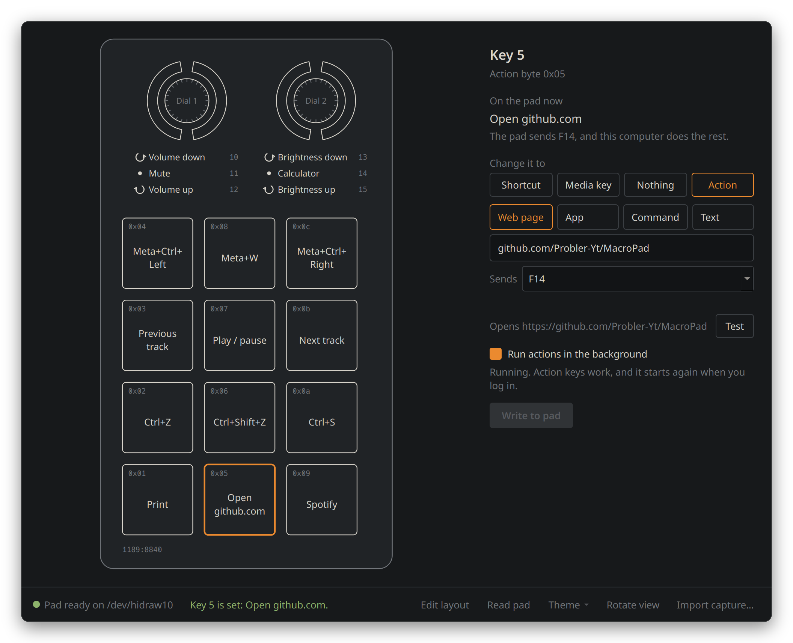
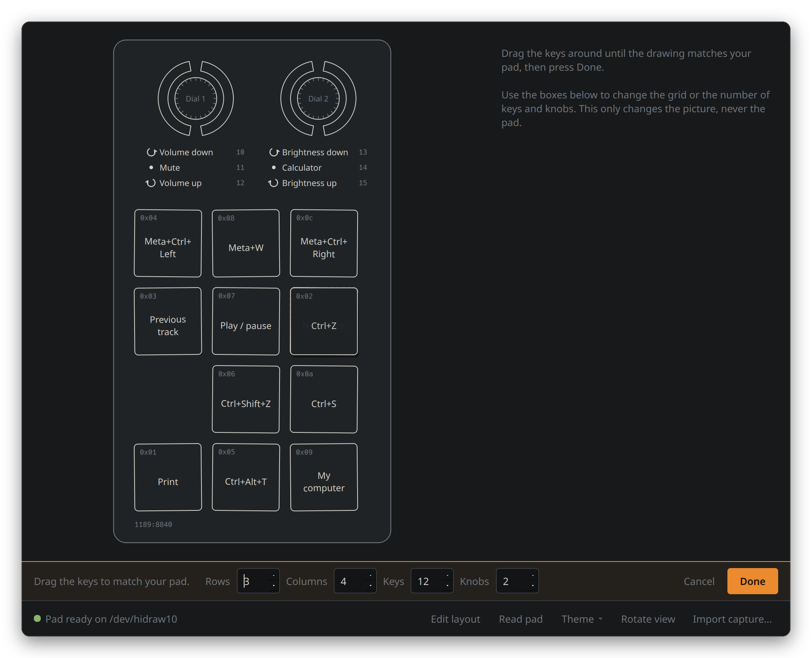
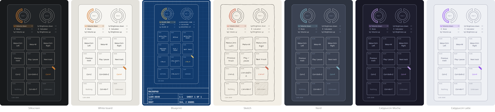
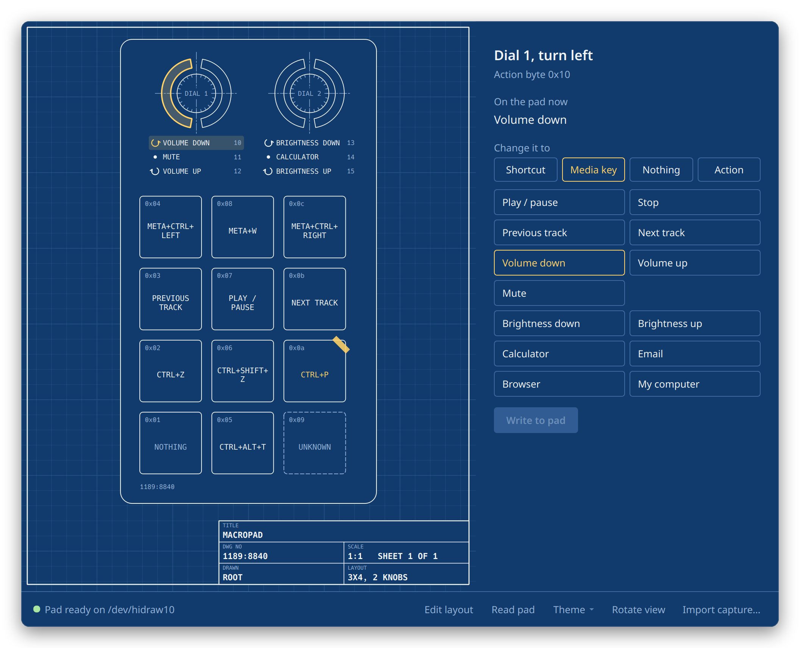
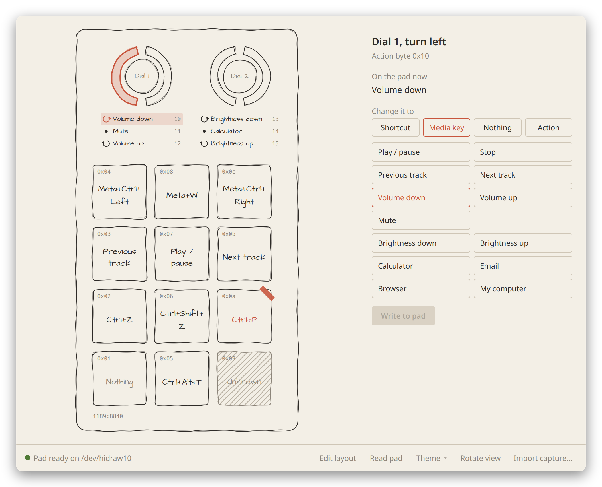
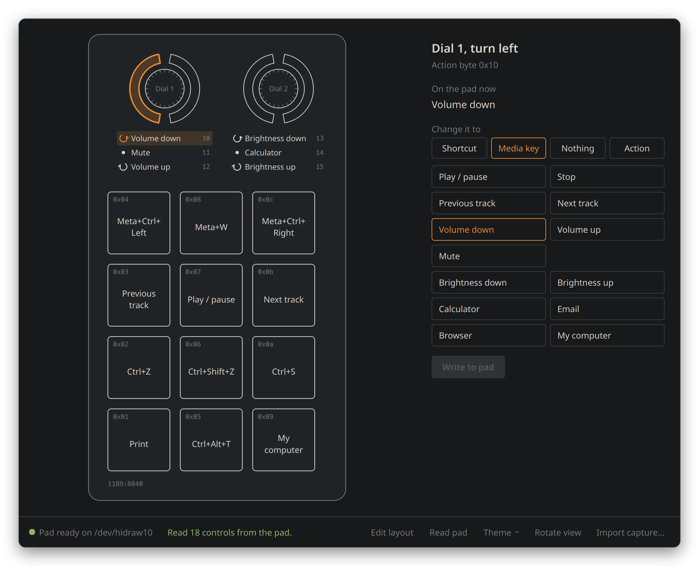

<p align="center">
  
</p>

<h1 align="center">MacroPad</h1>

<p align="center">
  <b>Set up your cheap 12 key, 2 knob USB macro pad on Linux.</b><br>
  No Windows. No virtual machine. No Wine. Just click a key and tell it what to do.
</p>

<p align="center">
  
  
  
  
  
  
</p>

<p align="center">
  
</p>

<p align="center">
  <a href="#-install">Install</a> &nbsp;|&nbsp;
  <a href="#-your-first-binding">First binding</a> &nbsp;|&nbsp;
  <a href="#-when-something-goes-wrong">Help</a> &nbsp;|&nbsp;
  <a href="#-other-pads-in-this-family">Other pads</a> &nbsp;|&nbsp;
  <a href="#-for-the-nerds">For the nerds</a>
</p>

---

> [!TIP]
> **In a hurry?** Open a terminal and paste this. It does everything, asks before changing anything, and is safe to run again.
> ```
> curl -fsSL https://raw.githubusercontent.com/Probler-Yt/MacroPad/main/install.sh | bash
> ```
> Never used a terminal? Perfect. [The step by step guide](#-install) was written for you.

---

## 📜 Why this exists

I left Windows.

It went fine. Games ran. My editor ran. Everything I cared about had a Linux version or a good replacement. Then I picked up the little AliExpress macro pad on my desk, the one with twelve keys and two knobs, and remembered that the software it came with is a Windows program called `MINI_KEYBOARD.exe` that looks like it was designed during a power cut.

People online were running **entire Windows virtual machines** just to change one key. Others kept a Windows partition alive for it. That is a lot of Windows for a thing that costs less than a pizza.

So I sat down with the vendor's software, the Linux kernel's USB sniffer, and a lot of stubbornness, and worked out exactly what bytes that program sends to the pad.

Once it worked, I found out I wasn't the first. **[ch57x-keyboard-tool](https://github.com/kriomant/ch57x-keyboard-tool)** has handled these pads from the command line since 2023, on Linux, macOS and Windows, and it's excellent. If you're happy editing a YAML file and running a command, go and use it.

But I wanted something a friend on their first week of Linux could use without ever seeing a config file. So this is the other half, the program I actually wanted:

- **It looks like your pad.** You click on a drawing of the real thing, not a settings list.
- **It's honest.** The pad can't tell anyone what's on it, so the app never pretends to know.
- **It's small, quick, and gets out of your way.** Open it, change a key, close it. The pad remembers the rest.
- **It's free, forever.** GPL-3.0. Fork it, fix it, add your pad.

If you've ever thought "I'd switch to Linux, but...", I hope this is one less "but".

---

## 🔍 Is this my pad?

Probably, if yours looks like this:

- **12 keys** in a grid, plus **2 rotary knobs** (they turn and they click).
- Came from AliExpress, Amazon, Temu, eBay, or similar, often with no brand name.
- Came with software called **`MINI_KEYBOARD.exe`**, or a download link to it.
- Plugs in with USB and works as a keyboard straight away.

To check, run `lsusb` in a terminal and look for a line like:

```
Bus 001 Device 011: ID 1189:8840 Acer Communications & Multimedia USB Composite Device
```

The part that matters is **`1189:8840`**. Ignore "Acer": these pads borrow that ID and have nothing to do with Acer.

> [!NOTE]
> **Different number, like `1189:8890` or `1189:8842`?** That's a sibling of this pad with a different layout. MacroPad will spot it and tell you it isn't supported yet, rather than risk sending it the wrong thing. [ch57x-keyboard-tool](https://github.com/kriomant/ch57x-keyboard-tool) supports several of them today, and [you can help add yours here](#-other-pads-in-this-family).

---

## ✨ What it does

| | |
|---|---|
| 🎹 **Click the drawing** | The window shows your pad as it really is. Click a key, or any part of a knob (turn left, press, turn right). |
| ⌨️ **Keyboard shortcuts** | Anything like `Ctrl+C`, `Ctrl+Shift+T`, `Meta+Ctrl+Right`, `F5`. Type it or press **Record** and just do the combo. |
| 🎵 **Media keys** | Play/pause, next, previous, stop, volume, mute, **screen brightness**, calculator, email, browser, my computer. |
| 🚫 **Nothing** | Switch a key off completely, so a stray press does nothing. |
| 🔄 **Rotate view** | Stand your pad up or lay it flat. The drawing turns to match. |
| 📖 **Reads your pad** | Opens and asks the pad what it's actually holding, so you start from the truth. |
| 🔎 **Identifies unknown pads** | Asks an unrecognised pad about itself, read only, and refuses to write if it doesn't answer properly. |
| 📐 **Layout editor** | Drag the keys around until the drawing matches your pad. |
| 🎨 **Themes** | Seven, including an engineering blueprint and a pencil sketch. |
| 🚀 **Actions** | Make a key open a web page, launch an app, type a phrase or run a command. Optional. |
| 🧠 **Remembers what it wrote** | Keeps its own notes too, and marks anything it isn't sure about rather than guessing. |
| 🩺 **Tells you what's wrong** | Unplugged? No permission? Wrong pad? You get a plain explanation and the exact fix, with a copy button. |
| 📥 **Imports from the vendor app** | Set your pad up on Windows before? Bring that setup across. |

### Reading the drawing

<p align="center">
  
</p>

- **Written**: the app put this on the pad, so it knows exactly what's there.
- **Unknown**: stripes mean the app has no idea what this key does right now. It hasn't written it, and the pad can't be asked. Not broken, just a mystery.
- **Changed**: the orange tape means you've changed it here but haven't sent it to the pad yet.
- **Selected**: the orange outline is the one you're editing.

The tiny `0x04` in each corner is that key's **action byte**, the number the pad uses for it internally. You can ignore it forever. It's there for anyone [adding support for another pad](#-other-pads-in-this-family).

### MacroPad or ch57x-keyboard-tool?

Both write straight to the pad's own memory, so you can even use both. Pick whichever suits you:

| | MacroPad | [ch57x-keyboard-tool](https://github.com/kriomant/ch57x-keyboard-tool) |
|---|---|---|
| How you use it | Click a drawing of your pad | Write a YAML file, run a command |
| Pads | `1189:8840` (12 keys, 2 knobs) | `1189:8840`, `8842`, `8890`, several layouts |
| Systems | Linux | Linux, macOS, Windows |
| Shortcuts and media keys | Yes | Yes |
| Key sequences with delays | Not yet | Yes |
| Mouse actions, LED modes, extra layers | Not yet | Yes |
| Record a shortcut by pressing it | Yes | No |
| Read what's on the pad | Yes | No |
| Open web pages, apps, commands, type text | Yes, optional | No |
| Install and permissions | One line does both | AUR, a download or `cargo install`; rule by hand |

**Short version:** new to Linux, or just want to click things? MacroPad. Want every feature, a different pad, or a config file you can keep in git? ch57x-keyboard-tool.

Other people have built GUIs for these pads too, mostly for the smaller 3 and 6 key models, including one that runs in a web browser. You'll find them under the [ch57x topic on GitHub](https://github.com/topics/ch57x). The more of these there are, the fewer people are stuck running Windows for a macro pad.

---

## 🚀 Install

One command does everything: the app, the Qt libraries if you need them, the menu entry, and the USB permission rule. It asks before each step that needs your password, and it's safe to run again to update.

If you're comfortable in a terminal, [skip to the command](#step-2-copy-this-line). The steps below spell it out for anyone newer to Linux, since these pads are a lot of people's first reason to open one.

### Step 1: Open a terminal

A terminal is a window where you type commands instead of clicking. Nothing below can damage your system.

- **KDE Plasma** (CachyOS, Bazzite, Kubuntu, Fedora KDE, KDE neon): press the **Meta key** (the one with the Windows logo), type **`Konsole`**, press **Enter**.
- **GNOME** (Ubuntu, Fedora, Pop!_OS): press the **Meta key**, type **`Terminal`**, press **Enter**.
- **Almost anywhere**: try pressing **`Ctrl` + `Alt` + `T`** together.

### Step 2: Copy this line

Click the copy button on the right side of this box (or select the text and press `Ctrl+C`):

```
curl -fsSL https://raw.githubusercontent.com/Probler-Yt/MacroPad/main/install.sh | bash
```

<details>
<summary>What does that line actually do? (optional reading)</summary>

In plain words: "download the MacroPad installer from GitHub (`curl`), and run it (`| bash`)". The installer is a normal text file, and you can [read it here](install.sh) before running it if you like. Being suspicious of random commands from the internet is a healthy instinct, and I respect it.

</details>

### Step 3: Paste it and press Enter

> [!IMPORTANT]
> Pasting into a terminal is **`Ctrl` + `Shift` + `V`**, not `Ctrl+V`. Right click, then Paste, also works.

### Step 4: Answer the questions

The installer says what it's doing as it goes, and asks before anything that needs your password. Pressing Enter accepts the default.

It needs the password for two things: installing Qt on systems that don't have it, and writing one permission file so the app can talk to your pad. Everything else stays in your home folder.

> [!NOTE]
> Nothing appears on screen while you type a password in a terminal. No dots, no stars. That's deliberate, not a frozen prompt.

First run downloads around 100 MB on some systems. You'll see **All done.** when it's finished.

### Step 5: Replug the pad

Unplug it and plug it back in, so Linux applies the new permission.

### Step 6: Open MacroPad

Open your app menu, type **MacroPad**, and click it.

<p align="center">
  
</p>

A **green dot** and **Pad ready** at the bottom left means it's working. Anything else, and the panel on the right explains it, or see [When something goes wrong](#-when-something-goes-wrong).

The app reads your pad when it opens, so the drawing should fill in with whatever is already on it. Keys still showing as hatched are ones it couldn't read; press **Read pad** to ask again.

> [!TIP]
> To keep it handy: right click **MacroPad** in your app menu and choose **Pin to Task Manager** (Plasma) or **Pin to Dash** (GNOME).

---

## 🎯 Your first binding

### 1. Click a key on the drawing

It gets an orange outline, and the panel on the right shows what it currently does.

### 2. Type what you want it to do

Click **Shortcut**, then type the combo into the box using `+` between keys: `ctrl+z`, `ctrl+shift+t`, `meta+e`, `f5`. Underneath, it confirms what the key will send. The key on the drawing gets a strip of orange tape to show it's changed but not sent yet.

<p align="center">
  
</p>

### Or press Record and just do it

Click **Record**, then press the actual combo on your keyboard. The app catches it and fills in the box for you. It records the physical key you pressed, so the pad presses that same key whatever your keyboard layout (UK, German, French, anything).

<p align="center">
  
</p>

> [!NOTE]
> Your desktop grabs some combos (like most `Meta` shortcuts) before any app can see them. If Record doesn't catch one, just type it instead.

### Or pick a media key

Click **Media key** and pick from the list. Volume and brightness on the knobs is a classic.

<p align="center">
  
</p>

### Or make it do nothing

To clear a binding, click **Nothing** and write it. Keys set this way show **Nothing** in grey.

<p align="center">
  
</p>

### 3. Write it to the pad

Click **Write to pad**. Changed a few things? The orange **Write N changes** button at the bottom right sends them all at once.

<p align="center">
  
</p>

The bottom bar tells you exactly what happened. Green means it worked.

<p align="center">
  
</p>

### 4. Press the key

**Your bindings live on the pad itself**, so they keep working after a reboot, on another computer, even on Windows. Nothing stays running in the background, and you can close the app. (The one exception is [actions](#-make-a-key-open-a-web-page-an-app-type-text-or-run-a-command), which are opt in.)

---

## 🚀 Make a key open a web page, an app, type text, or run a command

The pad itself can only ever send key presses. It can't hold "open this website". But your computer can, so an action is split in two:

- **On the pad**, the key is set to one of **F13 to F24**. No keyboard you own has those, so nothing else reacts to them.
- **On your computer**, a small listener watches for them and does what you asked.

Click a key, choose **Action**, then pick **Web page**, **App** (from the apps you have installed), **Command**, or **Text**, and write it to the pad. **Test** runs it straight away so you can check it before relying on it.

<p align="center">
  
</p>

Then tick **Run actions in the background**. That starts the listener now and every time you log in. It runs as you, inside your desktop session, so web pages open in your own browser and apps start the way they would from your menu.

A few things worth knowing:

- **It's optional.** With it off, action keys send F13 to F24 and nothing happens. Every other key on the pad carries on working, because those live on the pad.
- **Changing what an action does doesn't touch the pad.** The key keeps its F13 to F24 code; only the computer's half changes.
- **You choose the key, or let it choose.** The **Sends** box shows all twelve, which ones other controls already use, and which ones your desktop is known to act on. Left on automatic, it tries the quiet ones first.
- **Twelve at most**, one per spare key. Plenty for a 12 key pad.
- **Text types a phrase wherever your cursor is**: a sign-off, an address, a reply you send twenty times a day. It can be several lines, and emoji and symbols like £ work on any keyboard layout, because it goes through the clipboard and then presses paste. That does mean it replaces whatever you'd copied. Terminals paste with Ctrl+Shift+V, so there's a tick box for that.
- **Commands run as you, in a shell.** Anything you could type in a terminal works, including scripts. Actions are kept in `~/.config/macropad/actions.json`, so treat that file like a script and don't paste in one from someone you don't trust.
- **No extra permissions.** The listener reads the pad through the same access the rest of the app already has.

Text needs two things the other actions don't: **wl-clipboard** (or xclip on X11) to set the clipboard, and permission to press the paste shortcut for you, which is the same rule Steam installs for its controllers. If either is missing, the Text page says so and gives you the commands to fix it.

The idea of pairing F13 to F24 with a listener comes from [armas01's macropad-controller](https://github.com/armas01/macropad/tree/main/macropad-controller), which does this for the 3 and 6 key pads.

## 🎛️ The knobs

Each knob does three separate things, and each gets its own binding:

| Part of the drawing | What you do on the pad |
|---|---|
| Left half of the ring | **Turn left** (anticlockwise), one click at a time |
| Middle circle | **Press** the knob down |
| Right half of the ring | **Turn right** (clockwise) |

You can also click the three lines of text under each knob. Every click of a turn sends the key once, so volume and brightness feel natural. Spin it fast and it keeps up.

> [!TIP]
> **Screen brightness on a desktop monitor** works too, if your desktop supports it. KDE Plasma 6 does it out of the box for monitors with DDC/CI (most modern ones; it's sometimes a setting in the monitor's own menu).

---

## 📐 If the drawing doesn't match your pad

Press **Edit layout** at the bottom. The keys start wobbling, and you can drag them around until the picture matches the pad in front of you. Two keys swap when you drop one onto the other, so nothing is ever lost.

The boxes along the bottom set the grid size and how many keys and knobs there are. **Done** saves it, **Cancel** puts it back.

<p align="center">
  
</p>

This only changes the picture. It never writes anything to the pad. It's there because the pad reports how many keys it has but not how they're arranged, so on a pad we haven't seen before the first guess can be wrong.

## 🎨 Themes

Seven of them, under **Theme** at the bottom of the window. The choice sticks.

<p align="center">
  
</p>

- **Silkscreen**, the default: a dark circuit board with white printed legends and Kapton tape for unwritten changes.
- **White board**: the same, on a white board, for anyone who wants a light theme.
- **Nord**, **Catppuccin Mocha** and **Catppuccin Latte**: the popular palettes, as their authors published them.

Two do more than change colour.

**Blueprint** draws the pad as an engineering drawing. White linework on cyanotype blue, over a drawing grid. Unknown keys become dashed hidden lines, the way drawings show edges you can't see. Chain lines cross each knob's centre. Lettering is in capitals, changes are marked up in yellow, and the sheet has a border and a proper title block with the drawing number, scale, layout, and your username as the draughtsman.

<p align="center">
  
</p>

**Sketch** is pencil on paper. Every line wanders slightly and is gone over twice, the way a hand draws, and unknown keys are shaded in. The wobble is seeded per key, so each one looks the same every time rather than shimmering as you move the mouse.

<p align="center">
  
</p>

## 🔄 Rotate view

Some people stand the pad up with the knobs on top. Some lay it flat with the knobs on the right. Click **Rotate view** at the bottom and the drawing turns to match. It remembers your choice.

<p align="center">
  
</p>

---

## 📥 Already set it up with the vendor app?

If you configured your pad with `MINI_KEYBOARD.exe` and recorded it with the included capture tool ([how](#capture-what-the-vendor-software-sends)), click **Import capture...** and choose the file. The app reads what was saved and fills in the drawing, so those keys stop showing as unknown.

Only do this if nothing has changed on the pad since that capture.

---

## 📖 Reading your pad

MacroPad asks the pad what it's holding when it opens, so the drawing shows what's really on the hardware rather than what some file thinks. There's a **Read pad** button at the bottom to ask again at any time.

Anything you've changed but not written yet is left alone when it reads, since that's your intent, not the pad's state.

### So what does "Unknown" mean now?

Hatched keys are ones the app hasn't been told about: either the pad didn't answer, or you haven't pressed Read pad. Press it and they fill in.

<p align="center">
  
</p>

The app still keeps its own notes, because a write can fail halfway. If that happens, that one control goes back to Unknown rather than claiming either the old or the new binding, and reading the pad clears it up.

> [!NOTE]
> This took a while to work out. The project was built assuming these pads were write only, because nothing documented a way to read them and the first captures only recorded traffic in one direction. They can be read. The story is in [For the nerds](#-for-the-nerds).

---

## 🩹 When something goes wrong

The app checks your pad every couple of seconds and explains any problem in the panel on the right, with the exact fix and a **Copy commands** button. Here's everything it might say.

### "No pad connected"

The app can't see your pad. Unplug it and plug it back in, or try another USB port. If it's a USB hub, try plugging straight into the computer.

### "No permission to write to the pad"

<p align="center">
  
</p>

Linux protects USB devices from apps by default. The installer normally sorts this out, so the easiest fix is to **run the install line again** and say yes when it asks. Or click **Copy commands**, paste them into a terminal (`Ctrl+Shift+V`), press Enter, and replug the pad.

The app is quite clever here. It checks the three usual reasons this happens and tells you which one it is:

- **No rule yet.** The permission file doesn't exist.
- **Rule not loaded.** It exists, but Linux hasn't noticed. Replug the pad.
- **Rule named wrong.** If you made one yourself called something like `99-macropad.rules`, it's read *too late* to work. It needs a number below 73. The app gives you the exact rename command. ([Why?](#the-udev-rule-that-cost-me-an-hour))

### "Heads up: keyd is remapping this pad"

<p align="center">
  
</p>

**keyd** is a program that changes keys as they travel from a keyboard to your desktop. If you set it up for this pad in the past (a common trick before this app existed), it may change what your pad sends. You don't need it for this pad any more. If you only used it for the pad, switch it off:

```
sudo systemctl disable --now keyd
```

Saving bindings works fine either way. keyd only affects keys *coming out* of the pad.

### "Found a 1189:xxxx pad, which this app doesn't know yet"

You have a sibling pad with a different layout. The app refuses to write to it on purpose, because the wrong layout could scramble it. [You can help add it.](#-other-pads-in-this-family)

### "Couldn't write Key 4: the pad stopped responding"

The pad dropped off USB partway through a write, which can happen with a loose cable or a busy hub. Unplug it, plug it back in, and click **Write to pad** again. That key shows as Unknown until you do.

### An action key does nothing

Check **Run actions in the background** is ticked, and that the status under it says it's running. If it is and the key still does nothing, run this in a terminal and press the key:

```
macropad actions --debug
```

It prints every report the pad's keyboard sends. If nothing appears, the listener can't see the pad; if something appears but no action runs, the output says which key arrived, which narrows it down. Stop it with `Ctrl+C` and open an issue with what it printed.

### A text key doesn't type anything

Select the key, open its Action page, and look under the text box. If something's missing it says what, with a **Copy fix** button; paste that into a terminal. The permission rule usually needs you to unplug the pad and plug it back in, or log out and back in, before it takes effect.

If nothing's reported as missing, press **Test**, then click into a text box within three seconds. If Test types but the pad key doesn't, check background actions are running.

### An action key also does something else

Linux gives some of the spare keys a meaning of its own, so your desktop can react to them as well as MacroPad. On Plasma 6, **F13** opens System Settings, **F20** mutes the microphone and **F21** toggles the touchpad. **F22** and **F23** are touchpad on and off in the same table.

The easy fix is to pick a different key in the **Sends** box and write it again; the automatic choice already avoids these. If you'd rather keep the key, you can remove its desktop shortcut instead: in System Settings, open **Keyboard**, then **Shortcuts**, search for what it does ("Mute Microphone", "Toggle Touchpad" and so on), and clear the shortcut.

### Record doesn't catch my shortcut

Your desktop keeps some combos for itself (on Plasma, most `Meta` shortcuts), so no app ever sees them. Type it into the box instead, like `meta+ctrl+right`.

### A media key does nothing

Play, volume, mute and brightness work everywhere. **Calculator**, **Email**, **Browser** and **My computer** depend on your desktop having an app assigned to them. If one does nothing, set it up in your desktop's shortcut settings.

### "qt.qpa.services: Failed to register with host portal" in the terminal

Harmless. It only appears if you run the app before its launcher is installed. The installer adds the launcher, and the message goes away.

### The window looks wrong or won't open

Run `macropad` in a terminal and read the last few lines it prints. If it mentions `xcb` or a "platform plugin", run the installer again, which adds the missing library. If you're still stuck, [open an issue](https://github.com/Probler-Yt/MacroPad/issues) and paste what it printed.

---

## ♻️ Updating and removing

**To update:** run the same install line again. Your bindings and settings stay put.

**To remove:**

```
~/.local/share/macropad/app/uninstall.sh
```

It asks before removing the permission rule or the app's notes. Your pad keeps whatever you last wrote to it, forever, or until you change it.

---

## 🧩 Handy things to put on your pad

A few ideas for KDE Plasma, where these are the default shortcuts:

| Binding | What it does on Plasma |
|---|---|
| `meta+ctrl+left` / `meta+ctrl+right` | Switch virtual desktop (also works on Windows!) |
| `meta+w` | Overview of all your windows |
| `meta+d` | Show the desktop |
| `ctrl+alt+t` | Open a terminal |
| `printscreen` | Screenshot with Spectacle |
| `ctrl+shift+t` | Reopen the tab you just closed (browsers) |
| Media: Brightness down / up on a knob | Monitor brightness, silky smooth |

> [!TIP]
> Virtual desktop switching needs at least two desktops. **System Settings**, then **Virtual Desktops**, then **Add**.

---

## 🧬 Other pads in this family

This app is **confirmed on `1189:8840`**, the 12 key, 2 knob pad. It's the only one it knows so far.

> [!TIP]
> **Have a different pad right now?** [ch57x-keyboard-tool](https://github.com/kriomant/ch57x-keyboard-tool) supports `1189:8840`, `1189:8842` and `1189:8890` in several layouts (3, 6, 9, 12 and 15 keys) from the command line, today.

Siblings come in other sizes, and several share vendor ID `1189`. **They don't all speak the same language:** ch57x-keyboard-tool has separate code for different families, and rOzzy1987's Windows project lists yet more IDs (`8830`, `8831`, `8832`, `8897`, `8874`) with their own formats. That's why MacroPad won't write to a pad it doesn't know.

<p align="center">
  
</p>

### Start here: ask the pad

Install MacroPad, plug your pad in, and run:

```
macropad detect
```

On most pads in this family that's the whole job. It asks the pad how many keys and knobs it has, reads back what's currently bound, and prints a report. Paste that into [an issue](https://github.com/Probler-Yt/MacroPad/issues) and your pad gets added to the known list.

The app offers the same thing: when it sees a pad it doesn't recognise, the panel has an **Ask the pad what it is** button.

### How it decides

Detection is read only, and the pad has to pass two tests before the app will write anything to it:

1. It answers the `0xFB` query with a sensible key and knob count.
2. It then reports a full layer, describing exactly the control slots that count implies.

A pad from a different family fails one of those, and the app leaves it alone rather than guessing.

The pad reports how many keys and knobs it has, but not how they're arranged, so the first guess at rows and columns may be wrong. Fix it with [Edit layout](#-if-the-drawing-doesnt-match-your-pad) and the drawing will match your hardware.

### If it doesn't answer

Some pads in this family speak an older protocol and won't answer. Working those out needs a capture of the vendor software, the same process used for this one. You'll need `MINI_KEYBOARD.exe` and Wine.

#### Capture what the vendor software sends

1. **See what your pad is:**
   ```
   python3 ~/.local/share/macropad/app/macropad-probe.py
   ```
   This only reads. It lists your pad's ID and its USB interfaces.

2. **Start the capture** (it watches USB traffic; it never sends anything):
   ```
   cd ~/.local/share/macropad/app
   sudo python3 macropad-capture.py
   ```

3. **In a second terminal**, open the vendor app with Wine:
   ```
   wine MINI_KEYBOARD.exe
   ```

4. In the vendor app, set **key 1 to the letter `a`** and click its save/apply button. Then set **each knob's turn left, press and turn right** to different letters, and save again.

5. Go back to the first terminal and press **`Ctrl+C`**. You now have a file called `macropad-capture.txt`.

6. **[Open an issue](https://github.com/Probler-Yt/MacroPad/issues)** with that file, your `macropad-probe.py` output, and a photo of your pad. That's genuinely all it takes to get your pad supported.

---

## 🪟 What about Windows?

Windows already has the vendor app, ugly as it is, and [ch57x-keyboard-tool](https://github.com/kriomant/ch57x-keyboard-tool) runs there too. **A friendly app on Linux was the gap, so Linux comes first.**

To be precise about what "Linux only" means here: the window is Qt and runs anywhere, and the protocol module is plain Python. The only Linux specific parts are finding the pad and opening it, which read `/sys/class/hidraw` and `/dev/hidraw`. Swapping those for a cross platform HID library is the whole port. If you run it on Windows today it opens and tells you it can't see any devices.

That said, the app is built on Qt, which runs on Windows and macOS too. The only Linux specific parts are the small pieces that talk to USB and check permissions. Swapping it for a cross platform one is on the [roadmap](#-roadmap), and once that's tested on real hardware, one app will work everywhere. If you'd like to help test on Windows, open an issue.

---

## 🤓 For the nerds

<details>
<summary><b>How this pad was reverse engineered</b></summary>

1. **Probe.** `macropad-probe.py` walks `/sys/class/hidraw` and decodes each HID report descriptor. The pad shows up as two interfaces: a normal keyboard (`Generic Desktop`) and a vendor defined one (usage page `0xff00`) with a 64 byte input and output report, ID 3. That's the config channel.
2. **Guess.** The upstream project documents two protocols, "Legacy" and "Extended". Both were tried. The pad accepted the reports and then quietly ignored them. Educated guessing had run out.
3. **Watch.** The breakthrough was noticing `MINI_KEYBOARD.exe` runs under Wine. Linux's `usbmon` can record every USB transfer, so `macropad-capture.py` watched the real software write a single key. Twenty minutes of watching beat hours of guessing.
4. **Repeat.** Separate captures of the knobs and of media keys filled in the rest. Every packet from every capture is now replayed by the test suite.

Lesson learned the hard way: [ch57x-keyboard-tool](https://github.com/kriomant/ch57x-keyboard-tool) had already worked out most of this, and its source is the best reference for these pads. Search before you sniff.

</details>

<details>
<summary><b>The wire format</b></summary>

Every binding is two 65 byte writes to `/dev/hidrawN`: a config report, then a commit.

```
03 fd 01 01 01 00 00 00 00 00 01 00 05 00 ...    key 1 -> 'b'
│  │  │  │  │  └──┬┘ └───┬──┘ │  │  └── keycode (HID usage 0x05 = b)
│  │  │  │  │     │      │    │  └───── modifier bitmask
│  │  │  │  │     │      │    └──────── count
│  │  │  │  │     │      └───────────── unused
│  │  │  │  │     └──────────────────── delay? (unverified, see below)
│  │  │  │  └────────────────────────── type: 1 keys, 2 media, 3 mouse, 8 LED
│  │  │  └───────────────────────────── layer, counted from 1
│  │  └──────────────────────────────── action: which control
│  └─────────────────────────────────── magic
└────────────────────────────────────── report ID

03 fd fe ff 00 00 ...                            commit
```

**Action bytes on 1189:8840**

| Control | Bytes |
|---|---|
| Keys 1 to 12 | `0x01` to `0x0c` (the firmware reserves up to `0x0f`) |
| Knob 1: turn left, press, turn right | `0x10`, `0x11`, `0x12` |
| Knob 2: turn left, press, turn right | `0x13`, `0x14`, `0x15` |

**Media keys** pack differently: count is always `2`, and the 16 bit consumer usage follows it directly, little endian.

```
03 fd 08 01 02 00 00 00 00 00 02 92 01 00 ...    key 8 -> Calculator (usage 0x0192)
```

**Modifier bitmask** (standard HID): `0x01` Ctrl, `0x02` Shift, `0x04` Alt, `0x08` Meta, and `0x10` to `0x80` for the right hand versions.

The vendor app sometimes sends several configs and one commit at the end. Both styles work. This app commits after every binding, so it always knows exactly which ones landed.

**Delays** are the open question. The byte field above comes from rOzzy1987's format and hasn't been seen on this pad. ch57x-keyboard-tool sends a delay as a separate report of type `5` instead, which is probably right. That's why sequences are switched off in the app until a capture settles it.

</details>

<a name="what-we-found"></a>
<details>
<summary><b>Three sources, compared</b></summary>

What each source sends to a `1189:8840`. The pad accepts the ch57x-keyboard-tool style and the vendor style, so it's evidently tolerant. Nothing here is a new discovery about the hardware; the last column is simply what the vendor's own software does, captured independently.

| | rOzzy1987 "Extended" | [ch57x-keyboard-tool](https://github.com/kriomant/ch57x-keyboard-tool) | Vendor app (captured) |
|---|---|---|---|
| Byte 1 of a config report | `0xFE` | `0xFE` | **`0xFD`** |
| Layers counted from | `0` | `1` | `1` |
| First knob action | `13` | `0x10` | `0x10` |
| Media: count, usage offset | from payload, 12 | `0`, 11 | **`2`**, 11 |
| Delay | bytes 5 and 6 | separate report, type `5` | not captured yet |
| Finishing a write | flash command | `aa aa`, `fd fe ff`, `aa aa` | `fd fe ff` |

rOzzy1987's format is for different product IDs, which is why porting it to this pad failed until the capture.

</details>

<details>
<summary><b>Reading the pad, and how we nearly missed it</b></summary>

The project ran for weeks on the assumption that these pads were write only. Two things caused that:

- Nothing documented a read. Neither rOzzy1987's project nor ch57x-keyboard-tool implements one.
- The capture tool only recorded **outgoing** transfers. So even though the pad had been answering all along, nothing was ever written down.

What settled it was noticing that the vendor software has a "view settings" button, and that it showed bindings written by MacroPad. It couldn't have known those from a file, so it was asking the pad. Capturing both directions gave the answer.

Two query commands, both answered on the interrupt IN endpoint of the same report id:

```
03 fb ...                       what are you?
03 fb 0c 02                     reply: 12 keys, 2 knobs

03 fa 0f 03 01 02 ...           send me layer 1
                                (15 key slots, 3 layers, layer 1, 2 knobs)
03 fa 02 01 01 00 ... 01 05 17  key 2 is ctrl+alt+t
03 fa 10 01 02 00 ... 01 ea 00  dial 1 left is volume down
                                ... one report per control, then silence
```

Replies use the same layout as a config write, with `0xFA` in place of the `0xFD` magic. Media replies carry a count of 1 where writes send 2; both are accepted.

Three things fell out of it:

- **The pad reports its own layout**, so key and knob counts don't have to be guessed from the USB ID.
- **There are three layers**, and the firmware keeps 15 key slots and 3 knobs whatever the hardware has. Ours answers for 6 controls that don't physically exist.
- **The dial mapping is confirmed from the other direction.** Reading back what we had written returns exactly the mapping we assumed, which is stronger evidence than a write that appeared to work.

The vendor's request has trailing bytes that change between runs and look like uninitialised memory from the Windows program. Zeros work fine.

</details>

<details>
<summary><b>usbmon only shows you 32 bytes</b></summary>

The kernel's `usbmon` text interface caps captured data at 32 bytes per transfer. Every line in a capture is exactly 32 bytes, even though the reports are 65. For single keys and media that's plenty. For long key sequences, anything past the 10th key lands in bytes nobody has seen yet. If you're capturing long macros, use Wireshark or the binary `/dev/usbmonN` interface instead.

</details>

<a name="the-udev-rule-that-cost-me-an-hour"></a>
<details>
<summary><b>The udev rule that cost me an hour</b></summary>

The standard way to give desktop users access to a device is `TAG+="uaccess"` in a udev rule. Everyone names these `99-something.rules`. **That doesn't work.**

udev reads every rules file in one lexical order by filename. The tag is only turned into an actual permission by systemd's `73-seat-late.rules`, which contains:

```
TAG=="uaccess", ENV{MAJOR}!="", RUN{builtin}+="uaccess"
```

A rule in `99-macropad.rules` adds the tag *after* that line has already run. The device is tagged, and nothing ever acts on it. Same for a file with no number at all, since letters sort after digits. The rule has to sort before `73-`, so MacroPad uses `60-macropad.rules`.

The app's permission check reads `udevadm info` to see whether the device got the tag, finds any rule file mentioning the pad, and compares its name against whichever file on *your* system applies the permission.

</details>

<details>
<summary><b>Where the app keeps its notes</b></summary>

`~/.config/macropad/state-1189-8840.json` holds what the app last read from or wrote to the pad. Since the pad can be read, this is a cache rather than the source of truth. Every entry is exactly a command the CLI understands:

```json
{
  "device": "1189:8840",
  "format": 1,
  "layers": {
    "1": {
      "dial1-left": { "binding": { "media": "volumedown" }, "written": "2026-09-11T18:02:11" },
      "key4":       { "binding": { "keys": "super+ctrl+left" }, "written": "2026-09-11T18:02:11" },
      "key7":       { "reason": "write interrupted after 1 of 2 reports", "unknown": true }
    }
  }
}
```

It's written atomically (write, then rename), so a crash can never leave half a file.

</details>

<details>
<summary><b>Command line</b></summary>

No window needed. `macropad.py` is plain Python with nothing to install:

```
cd ~/.local/share/macropad/app
python3 macropad.py controls                      # every name you can use
python3 macropad.py set key1 ctrl+c
python3 macropad.py set dial1-right volumeup
python3 macropad.py set key3 "ctrl+shift+n" --dry-run   # show the bytes, send nothing
python3 macropad.py set action:0x10 f5            # raw action byte, for other pads
macropad doctor                                   # the app's permission check, in text
```

The CLI doesn't update the app's notes. Things set this way show as whatever the app last knew.

</details>

<details>
<summary><b>Tests</b></summary>

```
python3 -m unittest -v
```

The suite replays every packet from every real capture in `tests/captures/`, decodes it, re-encodes it, and checks the bytes match exactly. It also covers the permission diagnosis, half-finished writes, and builds the whole window offscreen. Screenshots in this README are generated by `docs/make_screenshots.py` from the real app.

</details>

### Project layout

```
macropad.py              the protocol and the command line tool (no dependencies)
macropad_gui/
  core.py                bindings, the app's notes, the permission check, writing
  padview.py             the drawing of the pad
  themes.py              palettes and drawing styles
  fonts/                 the Sketch theme's handwriting font, with its licence
  app.py                 the window
  keymap.py              physical key to HID name, for Record
macropad-probe.py        read only: what is this device?
macropad-capture.py      watch what the vendor software sends (usbmon)
macropad-handshake.py    which report IDs does a pad accept?
install.sh, uninstall.sh
packaging/               launcher icon and the udev rule
tests/                   real captures and the tests that replay them
```

---

## 🧭 Roadmap

- [x] Keys, shortcuts and media keys on `1189:8840`
- [x] Both knobs, all three actions each
- [x] Upright and flat views
- [x] Reading the pad, so the app shows what's really on it
- [x] One line installer for any distro
- [ ] **Key sequences with delays**. Reading the pad shows two-key sequences stored in the layout we assumed, so this is close
- [ ] **Layers 2 and 3**, which the pad turns out to have
- [ ] LED modes
- [ ] AUR package, so Arch users can install it like anything else
- [ ] Knob press to toggle brightness between 0% and 100%
- [ ] Save and switch between named profiles (gaming, editing, streaming)
- [ ] **Windows and macOS** via a cross platform USB layer
- [x] Detecting a pad's key and knob counts by asking it
- [x] A layout editor, since the pad doesn't report how its keys are arranged
- [x] Actions: open web pages, apps and commands from a key
- [x] Text snippets: type a phrase from a key
- [x] Themes, including Blueprint and Sketch
- [ ] **More pads**: every report sent in gets us closer

---

## 🙏 Credits

- **[kriomant/ch57x-keyboard-tool](https://github.com/kriomant/ch57x-keyboard-tool)**, the MIT licensed command line tool that has supported these pads since 2023. It does more than MacroPad does today (layers, sequences, mouse, LEDs, more pads, every OS), and its source is the best reference there is. Go give it a star.
- **[rOzzy1987/MacroPad](https://github.com/rOzzy1987/MacroPad)**, whose Windows project this app's protocol code started from.
- **[armas01/macropad](https://github.com/armas01/macropad)**, whose macropad-controller showed the F13 to F24 approach to actions.
- **[Nord](https://www.nordtheme.com)** and **[Catppuccin](https://catppuccin.com)** for their palettes (both MIT), and Kimberly Geswein for **Architects Daughter**, the Sketch theme's handwriting, under the SIL Open Font License (`macropad_gui/fonts/OFL.txt`).
- Everyone on forums who documented running a whole VM to change a key. Your suffering was noted.

## ⚖️ Licence

GPL-3.0, the same as the project it builds on. Use it, change it, share it. If you share a changed version, share the source too.

---

<sub>
<b>Also known as:</b> macro pad software for Linux, MINI_KEYBOARD.exe alternative, mini keyboard configurator, 12 key macro keyboard with 2 knobs, USB macro keypad with rotary encoders, AliExpress macro pad driver for Linux, custom shortcut keypad for Linux, Acer Communications &amp; Multimedia USB Composite Device (1189:8840), macropad on Arch, CachyOS, Fedora, Ubuntu, Linux Mint, Pop!_OS, Bazzite, KDE Plasma and GNOME, on Wayland and X11.
</sub>
