<p align="center">
  
</p>

<h1 align="center">MacroPad</h1>

<p align="center">
  <b>Set up your cheap 12 key, 2 knob USB macro pad on Linux.</b><br>
  No Windows. No virtual machine. No Wine. Just click a key and tell it what to do.
</p>

<p align="center">
  
  
  
  
  
  
</p>

<p align="center">
  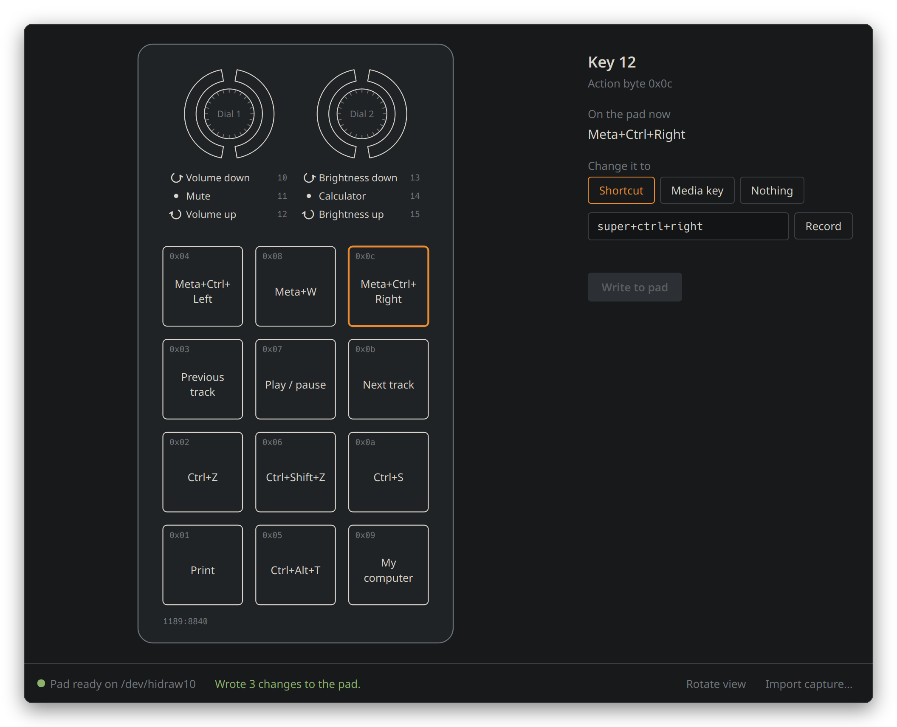
</p>

<p align="center">
  <a href="#-install-it-the-whole-world-is-counting-on-you">Install</a> &nbsp;|&nbsp;
  <a href="#-your-first-binding">First binding</a> &nbsp;|&nbsp;
  <a href="#-when-something-goes-wrong">Help</a> &nbsp;|&nbsp;
  <a href="#-other-pads-in-this-family">Other pads</a> &nbsp;|&nbsp;
  <a href="#-for-the-nerds">For the nerds</a>
</p>

---

> [!TIP]
> **In a hurry?** Open a terminal and paste this. It does everything, asks before changing anything, and is safe to run again.
> ```
> curl -fsSL https://raw.githubusercontent.com/Probler-Yt/MacroPad/main/install.sh | bash
> ```
> Never used a terminal? Perfect. [The step by step guide](#-install-it-the-whole-world-is-counting-on-you) was written for you.

---

## 📜 Why this exists

I left Windows.

It went fine. Games ran. My editor ran. Everything I cared about had a Linux version or a good replacement. Then I picked up the little AliExpress macro pad on my desk, the one with twelve keys and two knobs, and remembered that the software it came with is a Windows program called `MINI_KEYBOARD.exe` that looks like it was designed during a power cut.

People online were running **entire Windows virtual machines** just to change one key. Others kept a Windows partition alive for it. That is a lot of Windows for a thing that costs less than a pizza.

So I sat down with the vendor's software, the Linux kernel's USB sniffer, and a lot of stubbornness, and worked out exactly what bytes that program sends to the pad.

Once it worked, I found out I wasn't the first. **[ch57x-keyboard-tool](https://github.com/kriomant/ch57x-keyboard-tool)** has handled these pads from the command line since 2023, on Linux, macOS and Windows, and it's excellent. If you're happy editing a YAML file and running a command, go and use it.

But I wanted something a friend on their first week of Linux could use without ever seeing a config file. So this is the other half, the program I actually wanted:

- **It looks like your pad.** You click on a drawing of the real thing, not a settings list.
- **It's honest.** The pad can't tell anyone what's on it, so the app never pretends to know.
- **It's small, quick, and gets out of your way.** Open it, change a key, close it. The pad remembers the rest.
- **It's free, forever.** GPL-3.0. Fork it, fix it, add your pad.

If you've ever thought "I'd switch to Linux, but...", I hope this is one less "but".

---

## 🔍 Is this my pad?

Probably, if yours looks like this:

- **12 keys** in a grid, plus **2 rotary knobs** (they turn and they click).
- Came from AliExpress, Amazon, Temu, eBay, or similar, often with no brand name.
- Came with software called **`MINI_KEYBOARD.exe`**, or a download link to it.
- Plugs in with USB and works as a keyboard straight away.

To be sure, open a terminal ([how?](#step-1-open-a-terminal)), type `lsusb` and press Enter. Look for this line:

```
Bus 001 Device 011: ID 1189:8840 Acer Communications & Multimedia USB Composite Device
```

The important bit is **`1189:8840`**. Don't worry about the "Acer" part: it isn't made by Acer, these pads just borrow that ID.

> [!NOTE]
> **Different number, like `1189:8890` or `1189:8842`?** That's a sibling of this pad with a different layout. MacroPad will spot it and tell you it isn't supported yet, rather than risk sending it the wrong thing. [ch57x-keyboard-tool](https://github.com/kriomant/ch57x-keyboard-tool) supports several of them today, and [you can help add yours here](#-other-pads-in-this-family).

---

## ✨ What it does

| | |
|---|---|
| 🎹 **Click the drawing** | The window shows your pad as it really is. Click a key, or any part of a knob (turn left, press, turn right). |
| ⌨️ **Keyboard shortcuts** | Anything like `Ctrl+C`, `Ctrl+Shift+T`, `Meta+Ctrl+Right`, `F5`. Type it or press **Record** and just do the combo. |
| 🎵 **Media keys** | Play/pause, next, previous, stop, volume, mute, **screen brightness**, calculator, email, browser, my computer. |
| 🚫 **Nothing** | Switch a key off completely, so a stray press does nothing. |
| 🔄 **Rotate view** | Stand your pad up or lay it flat. The drawing turns to match. |
| 🧠 **Remembers what it wrote** | The pad can't be read back, so the app keeps its own notes and marks anything it doesn't know. |
| 🩺 **Tells you what's wrong** | Unplugged? No permission? Wrong pad? You get a plain explanation and the exact fix, with a copy button. |
| 📥 **Imports from the vendor app** | Set your pad up on Windows before? Bring that setup across. |

### Reading the drawing

<p align="center">
  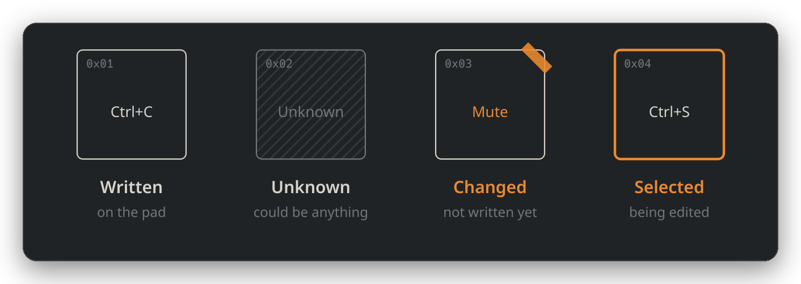
</p>

- **Written**: the app put this on the pad, so it knows exactly what's there.
- **Unknown**: stripes mean the app has no idea what this key does right now. It hasn't written it, and the pad can't be asked. Not broken, just a mystery.
- **Changed**: the orange tape means you've changed it here but haven't sent it to the pad yet.
- **Selected**: the orange outline is the one you're editing.

The tiny `0x04` in each corner is that key's **action byte**, the number the pad uses for it internally. You can ignore it forever. It's there for anyone [adding support for another pad](#-other-pads-in-this-family).

### MacroPad or ch57x-keyboard-tool?

Both write straight to the pad's own memory, so you can even use both. Pick whichever suits you:

| | MacroPad | [ch57x-keyboard-tool](https://github.com/kriomant/ch57x-keyboard-tool) |
|---|---|---|
| How you use it | Click a drawing of your pad | Write a YAML file, run a command |
| Pads | `1189:8840` (12 keys, 2 knobs) | `1189:8840`, `8842`, `8890`, several layouts |
| Systems | Linux | Linux, macOS, Windows |
| Shortcuts and media keys | Yes | Yes |
| Key sequences with delays | Not yet | Yes |
| Mouse actions, LED modes, extra layers | Not yet | Yes |
| Record a shortcut by pressing it | Yes | No |
| Install and permissions | One line does both | AUR, a download or `cargo install`; rule by hand |

**Short version:** new to Linux, or just want to click things? MacroPad. Want every feature, a different pad, or a config file you can keep in git? ch57x-keyboard-tool.

Other people have built GUIs for these pads too, mostly for the smaller 3 and 6 key models, including one that runs in a web browser. You'll find them under the [ch57x topic on GitHub](https://github.com/topics/ch57x). The more of these there are, the fewer people are stuck running Windows for a macro pad.

---

## 🚀 Install it (the whole world is counting on you)

Welcome. Maybe this is your first week on Linux. Maybe it's your first *hour*. Either way, you are about to do something brave and important, and I'm going to walk you through every single click. Nothing here can break your computer. Deep breath. Let's save the world.

### Step 0: Plug in your pad

Plug the macro pad into a USB port. That's it. Step zero complete. You're doing amazing.

### Step 1: Open a terminal

A **terminal** is a window where you type instructions instead of clicking. It looks scary. It isn't. Think of it as a very literal assistant who does exactly what you type.

How to open one:

- **KDE Plasma** (CachyOS, Bazzite, Kubuntu, Fedora KDE, KDE neon): press the **Meta key** (the one with the Windows logo), type **`Konsole`**, press **Enter**.
- **GNOME** (Ubuntu, Fedora, Pop!_OS): press the **Meta key**, type **`Terminal`**, press **Enter**.
- **Almost anywhere**: try pressing **`Ctrl` + `Alt` + `T`** together.

A window with a blinking cursor appears. Hello, terminal. 👋

### Step 2: Copy this line

Click the copy button on the right side of this box (or select the text and press `Ctrl+C`):

```
curl -fsSL https://raw.githubusercontent.com/Probler-Yt/MacroPad/main/install.sh | bash
```

<details>
<summary>What does that line actually do? (optional reading)</summary>

In plain words: "download the MacroPad installer from GitHub (`curl`), and run it (`| bash`)". The installer is a normal text file, and you can [read it here](install.sh) before running it if you like. Being suspicious of random commands from the internet is a healthy instinct, and I respect it.

</details>

### Step 3: Paste it into the terminal

> [!IMPORTANT]
> **In a terminal, pasting is `Ctrl` + `Shift` + `V`**, not `Ctrl+V`. This catches out everyone coming from Windows. (Right click, then **Paste** works too.)

Paste it, then press **Enter**.

### Step 4: Answer the questions

The installer explains what it's doing as it goes. It will ask a couple of questions like **"Add it now? [Y/n]"**. Just press **Enter** to say yes.

When it asks for your **password**, type the password you use to log in to your computer and press **Enter**.

> [!WARNING]
> **Nothing appears while you type your password.** No dots, no stars, nothing. That's normal! Linux hides it completely so nobody can even count the letters. Just type it and press Enter. If you get it wrong it'll simply ask again.

It needs your password for two small things: installing Qt (the toolkit that draws the window) on some systems, and adding one file that lets the app talk to your pad. Everything else goes in your own home folder.

The first install downloads about 100 MB on some systems, so give it a minute. You'll see **All done.** in green when it's finished.

### Step 5: Unplug the pad and plug it back in

This makes Linux notice the new permission. Unplug. Count to two. Plug back in.

### Step 6: Open MacroPad

Open your app menu (press the **Meta key**), type **`MacroPad`**, and click it. 🎉

<p align="center">
  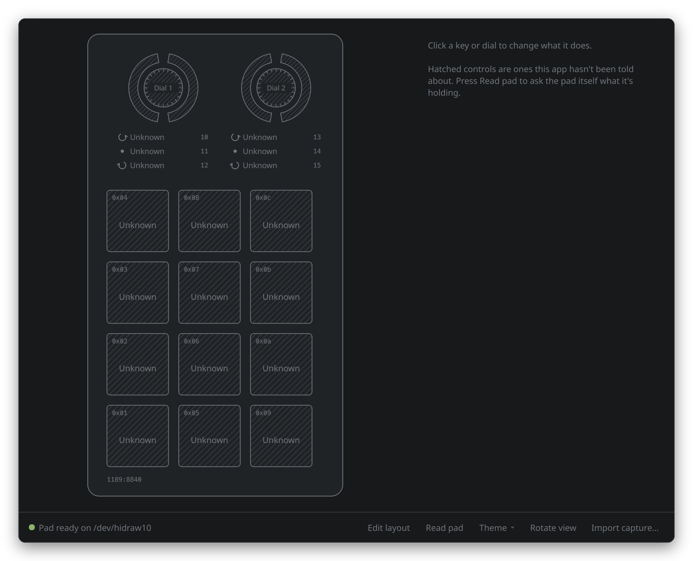
</p>

**Everything is striped the first time. That's correct.** The app hasn't written anything to your pad yet, and the pad has no way of telling it what's already there. You'll fix that in about thirty seconds.

Look at the bottom left. A **green dot** and **Pad ready** means everything worked. If you see something else, the panel on the right will tell you exactly what to do, or jump to [When something goes wrong](#-when-something-goes-wrong).

> [!TIP]
> Want it on your taskbar? Right click **MacroPad** in your app menu and choose **Pin to Task Manager** (Plasma) or **Pin to Dash** (GNOME).

**You did it.** The world is saved. Probably. Let's make sure by setting up a key.

---

## 🎯 Your first binding

### 1. Click a key on the drawing

Pick any key. It gets an orange outline, and the panel on the right shows what it does now.

### 2. Type what you want it to do

Click **Shortcut**, then type the combo into the box using `+` between keys: `ctrl+z`, `ctrl+shift+t`, `meta+e`, `f5`. Underneath, it confirms what the key will send. The key on the drawing gets a strip of orange tape to show it's changed but not sent yet.

<p align="center">
  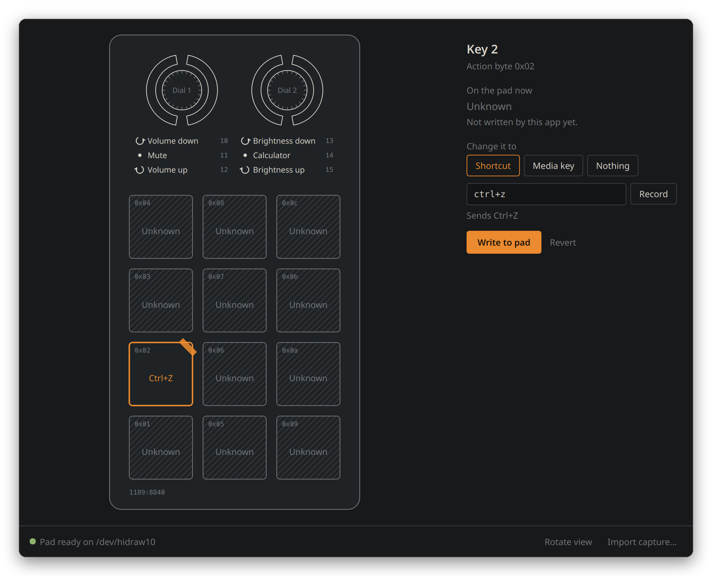
</p>

### Or press Record and just do it

Click **Record**, then press the actual combo on your keyboard. The app catches it and fills in the box for you. It records the physical key you pressed, so the pad presses that same key whatever your keyboard layout (UK, German, French, anything).

<p align="center">
  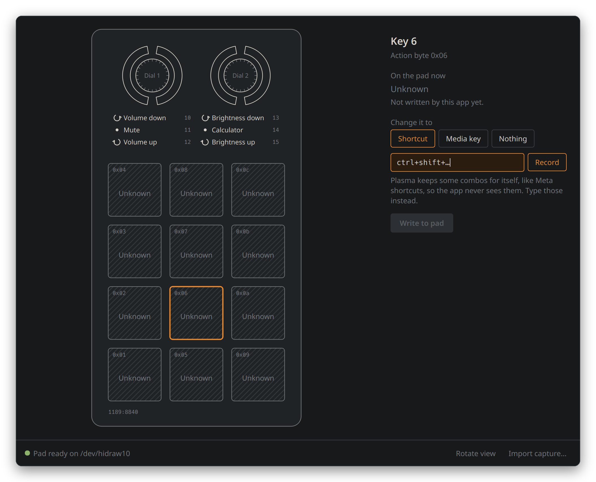
</p>

> [!NOTE]
> Your desktop grabs some combos (like most `Meta` shortcuts) before any app can see them. If Record doesn't catch one, just type it instead.

### Or pick a media key

Click **Media key** and pick from the list. Volume and brightness on the knobs is a classic.

<p align="center">
  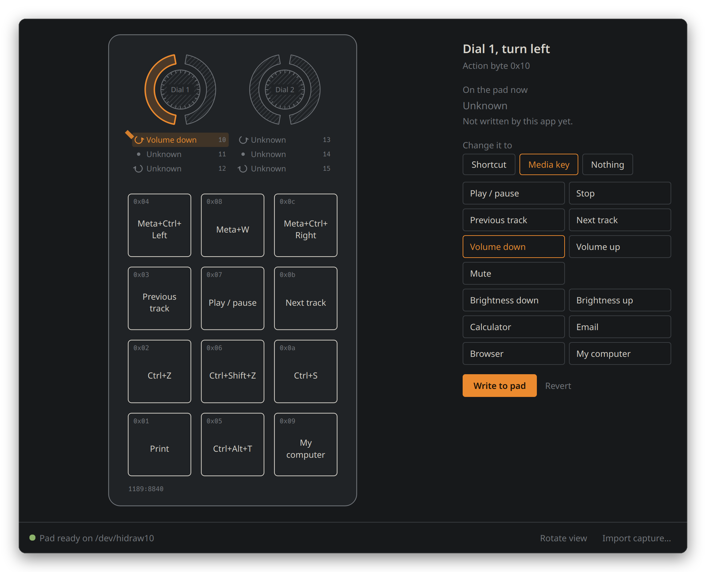
</p>

### Or make it do nothing

Bound something you don't want any more? Click **Nothing**, then write it. The key goes quiet: pressing it does nothing at all. Keys set this way show **Nothing** in grey on the drawing.

<p align="center">
  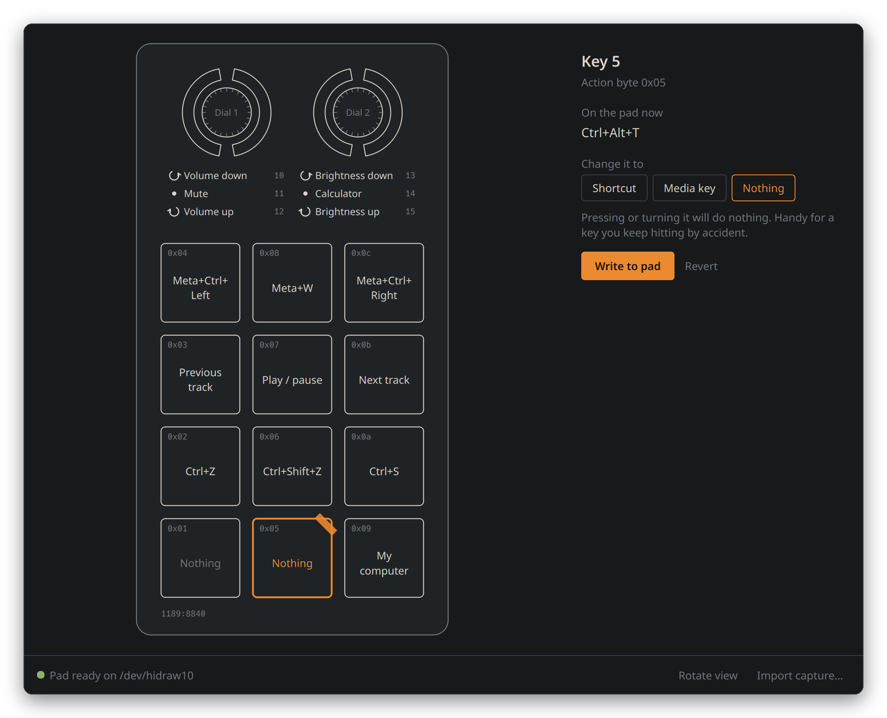
</p>

### 3. Write it to the pad

Click **Write to pad**. Changed a few things? The orange **Write N changes** button at the bottom right sends them all at once.

<p align="center">
  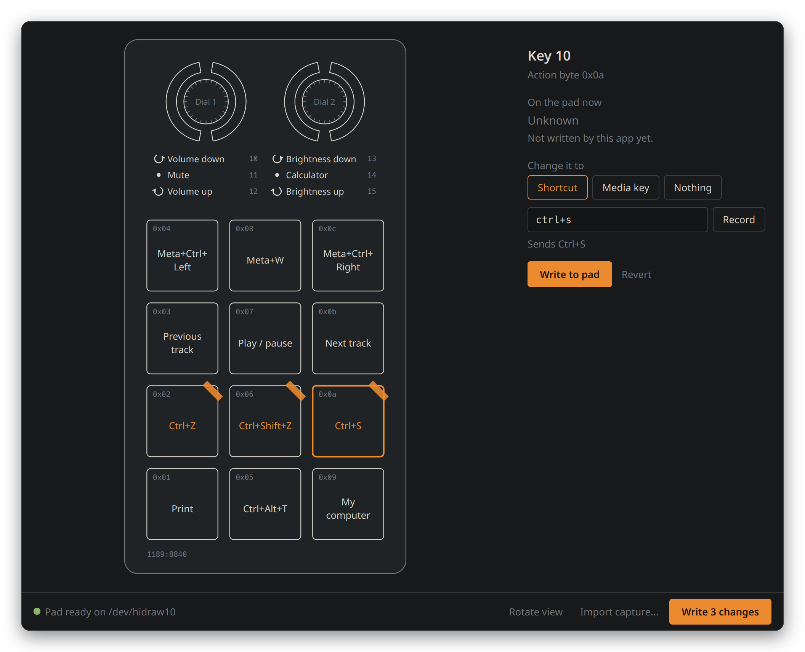
</p>

The bottom bar tells you exactly what happened. Green means it worked.

<p align="center">
  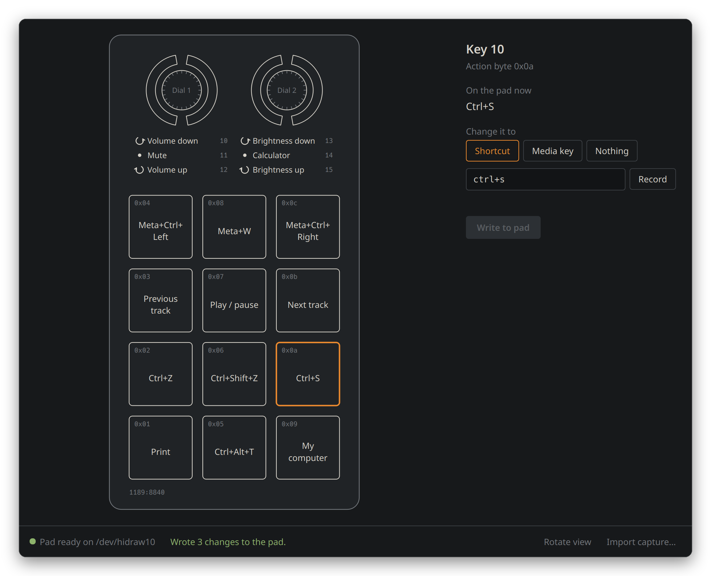
</p>

### 4. Press the key on your pad

It does the thing. You can close the app now. **Your bindings live on the pad itself**, so they keep working after a reboot, on another computer, even on Windows. Nothing needs to stay running.

---

## 🎛️ The knobs

Each knob does three separate things, and each gets its own binding:

| Part of the drawing | What you do on the pad |
|---|---|
| Left half of the ring | **Turn left** (anticlockwise), one click at a time |
| Middle circle | **Press** the knob down |
| Right half of the ring | **Turn right** (clockwise) |

You can also click the three lines of text under each knob. Every click of a turn sends the key once, so volume and brightness feel natural. Spin it fast and it keeps up.

> [!TIP]
> **Screen brightness on a desktop monitor** works too, if your desktop supports it. KDE Plasma 6 does it out of the box for monitors with DDC/CI (most modern ones; it's sometimes a setting in the monitor's own menu).

---

## 🔄 Rotate view

Some people stand the pad up with the knobs on top. Some lay it flat with the knobs on the right. Click **Rotate view** at the bottom and the drawing turns to match. It remembers your choice.

<p align="center">
  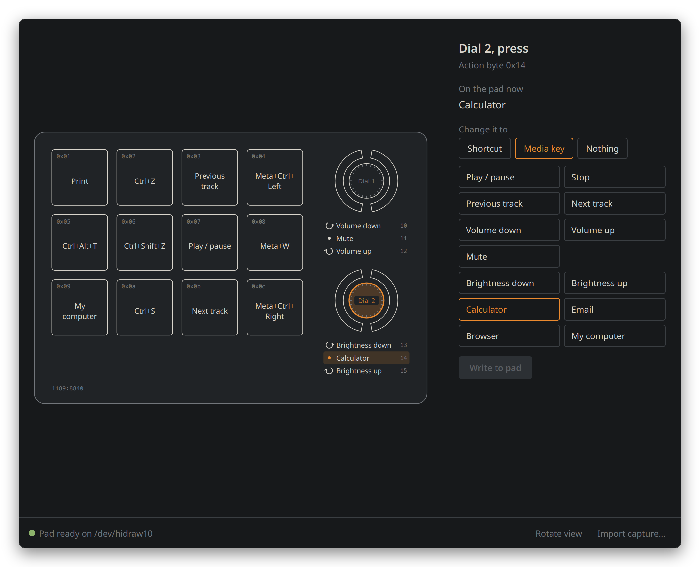
</p>

---

## 📥 Already set it up with the vendor app?

If you configured your pad with `MINI_KEYBOARD.exe` and recorded it with the included capture tool ([how](#capture-what-the-vendor-software-sends)), click **Import capture...** and choose the file. The app reads what was saved and fills in the drawing, so those keys stop showing as unknown.

Only do this if nothing has changed on the pad since that capture.

---

## ❓ Why does it say "Unknown"?

Because **these pads are write only.** You can send them new bindings, but there's no known way to ask one what it's currently set to. Even the official Windows app opens with every key blank.

So the app keeps its own notes of everything it has successfully written, and it's careful about it:

- If a write finishes, the key is marked with what was written.
- If a write fails before anything reaches the pad, nothing changes.
- If a write fails **halfway**, that key goes back to **Unknown**, because the honest answer is "no idea". Just write it again.

Striped keys aren't broken. They're just keys this app hasn't touched yet.

---

## 🩹 When something goes wrong

The app checks your pad every couple of seconds and explains any problem in the panel on the right, with the exact fix and a **Copy commands** button. Here's everything it might say.

### "No pad connected"

The app can't see your pad. Unplug it and plug it back in, or try another USB port. If it's a USB hub, try plugging straight into the computer.

### "No permission to write to the pad"

<p align="center">
  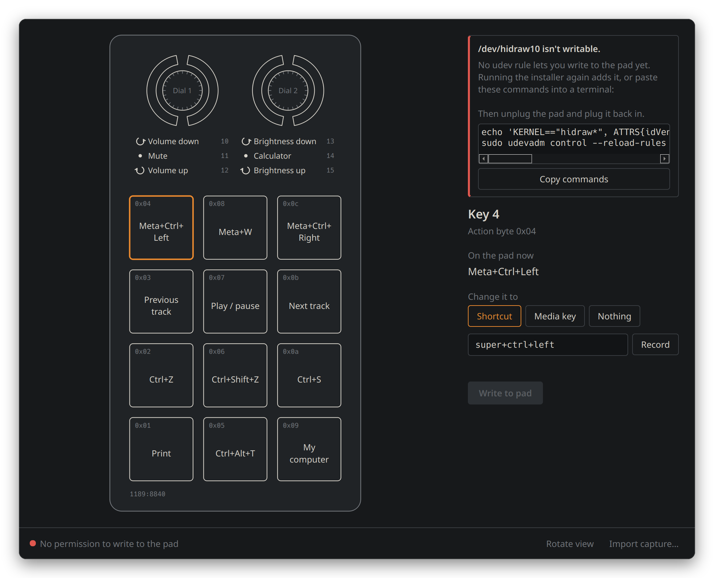
</p>

Linux protects USB devices from apps by default. The installer normally sorts this out, so the easiest fix is to **run the install line again** and say yes when it asks. Or click **Copy commands**, paste them into a terminal (`Ctrl+Shift+V`), press Enter, and replug the pad.

The app is quite clever here. It checks the three usual reasons this happens and tells you which one it is:

- **No rule yet.** The permission file doesn't exist.
- **Rule not loaded.** It exists, but Linux hasn't noticed. Replug the pad.
- **Rule named wrong.** If you made one yourself called something like `99-macropad.rules`, it's read *too late* to work. It needs a number below 73. The app gives you the exact rename command. ([Why?](#the-udev-rule-that-cost-me-an-hour))

### "Heads up: keyd is remapping this pad"

<p align="center">
  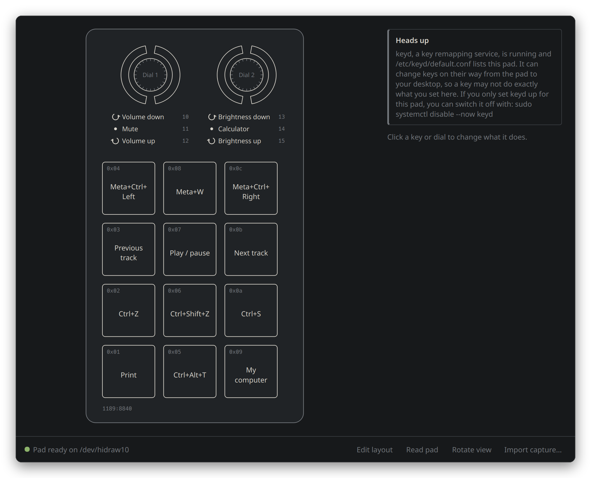
</p>

**keyd** is a program that changes keys as they travel from a keyboard to your desktop. If you set it up for this pad in the past (a common trick before this app existed), it may change what your pad sends. You don't need it for this pad any more. If you only used it for the pad, switch it off:

```
sudo systemctl disable --now keyd
```

Saving bindings works fine either way. keyd only affects keys *coming out* of the pad.

### "Found a 1189:xxxx pad, which this app doesn't know yet"

You have a sibling pad with a different layout. The app refuses to write to it on purpose, because the wrong layout could scramble it. [You can help add it.](#-other-pads-in-this-family)

### "Couldn't write Key 4: the pad stopped responding"

The pad dropped off USB partway through a write, which can happen with a loose cable or a busy hub. Unplug it, plug it back in, and click **Write to pad** again. That key shows as Unknown until you do.

### Record doesn't catch my shortcut

Your desktop keeps some combos for itself (on Plasma, most `Meta` shortcuts), so no app ever sees them. Type it into the box instead, like `meta+ctrl+right`.

### A media key does nothing

Play, volume, mute and brightness work everywhere. **Calculator**, **Email**, **Browser** and **My computer** depend on your desktop having an app assigned to them. If one does nothing, set it up in your desktop's shortcut settings.

### "qt.qpa.services: Failed to register with host portal" in the terminal

Harmless. It only appears if you run the app before its launcher is installed. The installer adds the launcher, and the message goes away.

### The window looks wrong or won't open

Run `macropad` in a terminal and read the last few lines it prints. If it mentions `xcb` or a "platform plugin", run the installer again, which adds the missing library. If you're still stuck, [open an issue](https://github.com/Probler-Yt/MacroPad/issues) and paste what it printed.

---

## ♻️ Updating and removing

**To update:** run the same install line again. Your bindings and settings stay put.

**To remove:**

```
~/.local/share/macropad/app/uninstall.sh
```

It asks before removing the permission rule or the app's notes. Your pad keeps whatever you last wrote to it, forever, or until you change it.

---

## 🧩 Handy things to put on your pad

A few ideas for KDE Plasma, where these are the default shortcuts:

| Binding | What it does on Plasma |
|---|---|
| `meta+ctrl+left` / `meta+ctrl+right` | Switch virtual desktop (also works on Windows!) |
| `meta+w` | Overview of all your windows |
| `meta+d` | Show the desktop |
| `ctrl+alt+t` | Open a terminal |
| `printscreen` | Screenshot with Spectacle |
| `ctrl+shift+t` | Reopen the tab you just closed (browsers) |
| Media: Brightness down / up on a knob | Monitor brightness, silky smooth |

> [!TIP]
> Virtual desktop switching needs at least two desktops. **System Settings**, then **Virtual Desktops**, then **Add**.

---

## 🧬 Other pads in this family

This app is **confirmed on `1189:8840`**, the 12 key, 2 knob pad. It's the only one it knows so far.

> [!TIP]
> **Have a different pad right now?** [ch57x-keyboard-tool](https://github.com/kriomant/ch57x-keyboard-tool) supports `1189:8840`, `1189:8842` and `1189:8890` in several layouts (3, 6, 9, 12 and 15 keys) from the command line, today.

Siblings come in other sizes, and several share vendor ID `1189`. **They don't all speak the same language:** ch57x-keyboard-tool has separate code for different families, and rOzzy1987's Windows project lists yet more IDs (`8830`, `8831`, `8832`, `8897`, `8874`) with their own formats. That's why MacroPad won't write to a pad it doesn't know.

<p align="center">
  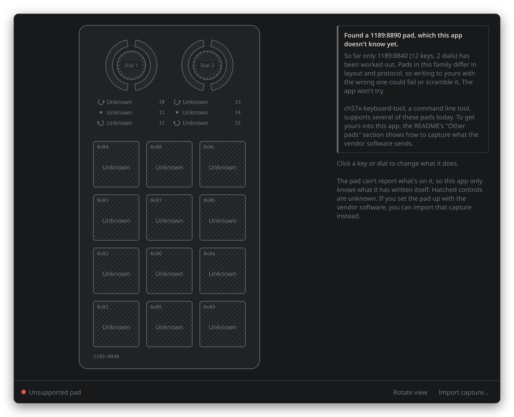
</p>

### You can add yours

If you'd like your pad in MacroPad too, you're exactly who this project needs. It's the same process used for this one. You'll need the vendor software (`MINI_KEYBOARD.exe`) and Wine.

#### Capture what the vendor software sends

1. **See what your pad is:**
   ```
   python3 ~/.local/share/macropad/app/macropad-probe.py
   ```
   This only reads. It lists your pad's ID and its USB interfaces.

2. **Start the capture** (it watches USB traffic; it never sends anything):
   ```
   cd ~/.local/share/macropad/app
   sudo python3 macropad-capture.py
   ```

3. **In a second terminal**, open the vendor app with Wine:
   ```
   wine MINI_KEYBOARD.exe
   ```

4. In the vendor app, set **key 1 to the letter `a`** and click its save/apply button. Then set **each knob's turn left, press and turn right** to different letters, and save again.

5. Go back to the first terminal and press **`Ctrl+C`**. You now have a file called `macropad-capture.txt`.

6. **[Open an issue](https://github.com/Probler-Yt/MacroPad/issues)** with that file, your `macropad-probe.py` output, and a photo of your pad. That's genuinely all it takes to get your pad supported.

---

## 🪟 What about Windows?

Windows already has the vendor app, ugly as it is, and [ch57x-keyboard-tool](https://github.com/kriomant/ch57x-keyboard-tool) runs there too. **A friendly app on Linux was the gap, so Linux comes first.**

That said, the app is built on Qt, which runs on Windows and macOS too. The only Linux specific parts are the small pieces that talk to USB and check permissions. Swapping it for a cross platform one is on the [roadmap](#-roadmap), and once that's tested on real hardware, one app will work everywhere. If you'd like to help test on Windows, open an issue.

---

## 🤓 For the nerds

<details>
<summary><b>How this pad was reverse engineered</b></summary>

1. **Probe.** `macropad-probe.py` walks `/sys/class/hidraw` and decodes each HID report descriptor. The pad shows up as two interfaces: a normal keyboard (`Generic Desktop`) and a vendor defined one (usage page `0xff00`) with a 64 byte input and output report, ID 3. That's the config channel.
2. **Guess.** The upstream project documents two protocols, "Legacy" and "Extended". Both were tried. The pad accepted the reports and then quietly ignored them. Educated guessing had run out.
3. **Watch.** The breakthrough was noticing `MINI_KEYBOARD.exe` runs under Wine. Linux's `usbmon` can record every USB transfer, so `macropad-capture.py` watched the real software write a single key. Twenty minutes of watching beat hours of guessing.
4. **Repeat.** Separate captures of the knobs and of media keys filled in the rest. Every packet from every capture is now replayed by the test suite.

Lesson learned the hard way: [ch57x-keyboard-tool](https://github.com/kriomant/ch57x-keyboard-tool) had already worked out most of this, and its source is the best reference for these pads. Search before you sniff.

</details>

<details>
<summary><b>The wire format</b></summary>

Every binding is two 65 byte writes to `/dev/hidrawN`: a config report, then a commit.

```
03 fd 01 01 01 00 00 00 00 00 01 00 05 00 ...    key 1 -> 'b'
│  │  │  │  │  └──┬┘ └───┬──┘ │  │  └── keycode (HID usage 0x05 = b)
│  │  │  │  │     │      │    │  └───── modifier bitmask
│  │  │  │  │     │      │    └──────── count
│  │  │  │  │     │      └───────────── unused
│  │  │  │  │     └──────────────────── delay? (unverified, see below)
│  │  │  │  └────────────────────────── type: 1 keys, 2 media, 3 mouse, 8 LED
│  │  │  └───────────────────────────── layer, counted from 1
│  │  └──────────────────────────────── action: which control
│  └─────────────────────────────────── magic
└────────────────────────────────────── report ID

03 fd fe ff 00 00 ...                            commit
```

**Action bytes on 1189:8840**

| Control | Bytes |
|---|---|
| Keys 1 to 12 | `0x01` to `0x0c` (the firmware reserves up to `0x0f`) |
| Knob 1: turn left, press, turn right | `0x10`, `0x11`, `0x12` |
| Knob 2: turn left, press, turn right | `0x13`, `0x14`, `0x15` |

**Media keys** pack differently: count is always `2`, and the 16 bit consumer usage follows it directly, little endian.

```
03 fd 08 01 02 00 00 00 00 00 02 92 01 00 ...    key 8 -> Calculator (usage 0x0192)
```

**Modifier bitmask** (standard HID): `0x01` Ctrl, `0x02` Shift, `0x04` Alt, `0x08` Meta, and `0x10` to `0x80` for the right hand versions.

The vendor app sometimes sends several configs and one commit at the end. Both styles work. This app commits after every binding, so it always knows exactly which ones landed.

**Delays** are the open question. The byte field above comes from rOzzy1987's format and hasn't been seen on this pad. ch57x-keyboard-tool sends a delay as a separate report of type `5` instead, which is probably right. That's why sequences are switched off in the app until a capture settles it.

</details>

<a name="what-we-found"></a>
<details>
<summary><b>Three sources, compared</b></summary>

What each source sends to a `1189:8840`. The pad accepts the ch57x-keyboard-tool style and the vendor style, so it's evidently tolerant. Nothing here is a new discovery about the hardware; the last column is simply what the vendor's own software does, captured independently.

| | rOzzy1987 "Extended" | [ch57x-keyboard-tool](https://github.com/kriomant/ch57x-keyboard-tool) | Vendor app (captured) |
|---|---|---|---|
| Byte 1 of a config report | `0xFE` | `0xFE` | **`0xFD`** |
| Layers counted from | `0` | `1` | `1` |
| First knob action | `13` | `0x10` | `0x10` |
| Media: count, usage offset | from payload, 12 | `0`, 11 | **`2`**, 11 |
| Delay | bytes 5 and 6 | separate report, type `5` | not captured yet |
| Finishing a write | flash command | `aa aa`, `fd fe ff`, `aa aa` | `fd fe ff` |

rOzzy1987's format is for different product IDs, which is why porting it to this pad failed until the capture.

</details>

<details>
<summary><b>usbmon only shows you 32 bytes</b></summary>

The kernel's `usbmon` text interface caps captured data at 32 bytes per transfer. Every line in a capture is exactly 32 bytes, even though the reports are 65. For single keys and media that's plenty. For long key sequences, anything past the 10th key lands in bytes nobody has seen yet. If you're capturing long macros, use Wireshark or the binary `/dev/usbmonN` interface instead.

</details>

<a name="the-udev-rule-that-cost-me-an-hour"></a>
<details>
<summary><b>The udev rule that cost me an hour</b></summary>

The standard way to give desktop users access to a device is `TAG+="uaccess"` in a udev rule. Everyone names these `99-something.rules`. **That doesn't work.**

udev reads every rules file in one lexical order by filename. The tag is only turned into an actual permission by systemd's `73-seat-late.rules`, which contains:

```
TAG=="uaccess", ENV{MAJOR}!="", RUN{builtin}+="uaccess"
```

A rule in `99-macropad.rules` adds the tag *after* that line has already run. The device is tagged, and nothing ever acts on it. Same for a file with no number at all, since letters sort after digits. The rule has to sort before `73-`, so MacroPad uses `60-macropad.rules`.

The app's permission check reads `udevadm info` to see whether the device got the tag, finds any rule file mentioning the pad, and compares its name against whichever file on *your* system applies the permission.

</details>

<details>
<summary><b>Where the app keeps its notes</b></summary>

`~/.config/macropad/state-1189-8840.json` holds everything the app has successfully written. Every entry is exactly a command the CLI understands:

```json
{
  "device": "1189:8840",
  "format": 1,
  "layers": {
    "1": {
      "dial1-left": { "binding": { "media": "volumedown" }, "written": "2026-09-11T18:02:11" },
      "key4":       { "binding": { "keys": "super+ctrl+left" }, "written": "2026-09-11T18:02:11" },
      "key7":       { "reason": "write interrupted after 1 of 2 reports", "unknown": true }
    }
  }
}
```

It's written atomically (write, then rename), so a crash can never leave half a file.

</details>

<details>
<summary><b>Command line</b></summary>

No window needed. `macropad.py` is plain Python with nothing to install:

```
cd ~/.local/share/macropad/app
python3 macropad.py controls                      # every name you can use
python3 macropad.py set key1 ctrl+c
python3 macropad.py set dial1-right volumeup
python3 macropad.py set key3 "ctrl+shift+n" --dry-run   # show the bytes, send nothing
python3 macropad.py set action:0x10 f5            # raw action byte, for other pads
macropad doctor                                   # the app's permission check, in text
```

The CLI doesn't update the app's notes. Things set this way show as whatever the app last knew.

</details>

<details>
<summary><b>Tests</b></summary>

```
python3 -m unittest -v
```

The suite replays every packet from every real capture in `tests/captures/`, decodes it, re-encodes it, and checks the bytes match exactly. It also covers the permission diagnosis, half-finished writes, and builds the whole window offscreen. Screenshots in this README are generated by `docs/make_screenshots.py` from the real app.

</details>

### Project layout

```
macropad.py              the protocol and the command line tool (no dependencies)
macropad_gui/
  core.py                bindings, the app's notes, the permission check, writing
  padview.py             the drawing of the pad
  app.py                 the window
  keymap.py              physical key to HID name, for Record
macropad-probe.py        read only: what is this device?
macropad-capture.py      watch what the vendor software sends (usbmon)
macropad-handshake.py    which report IDs does a pad accept?
install.sh, uninstall.sh
packaging/               launcher icon and the udev rule
tests/                   real captures and the tests that replay them
```

---

## 🧭 Roadmap

- [x] Keys, shortcuts and media keys on `1189:8840`
- [x] Both knobs, all three actions each
- [x] Upright and flat views
- [x] One line installer for any distro
- [ ] **Key sequences with delays** (ch57x-keyboard-tool shows the likely format; one capture to confirm)
- [ ] Layers 2 and 3, and LED modes
- [ ] AUR package, so Arch users can install it like anything else
- [ ] Knob press to toggle brightness between 0% and 100%
- [ ] Save and switch between named profiles (gaming, editing, streaming)
- [ ] **Windows and macOS** via a cross platform USB layer
- [ ] **More pads**: every capture sent in gets us closer

---

## 🙏 Credits

- **[kriomant/ch57x-keyboard-tool](https://github.com/kriomant/ch57x-keyboard-tool)**, the MIT licensed command line tool that has supported these pads since 2023. It does more than MacroPad does today (layers, sequences, mouse, LEDs, more pads, every OS), and its source is the best reference there is. Go give it a star.
- **[rOzzy1987/MacroPad](https://github.com/rOzzy1987/MacroPad)**, whose Windows project this app's protocol code started from.
- Everyone on forums who documented running a whole VM to change a key. Your suffering was noted.

## ⚖️ Licence

GPL-3.0, the same as the project it builds on. Use it, change it, share it. If you share a changed version, share the source too.

---

<sub>
<b>Also known as:</b> macro pad software for Linux, MINI_KEYBOARD.exe alternative, mini keyboard configurator, 12 key macro keyboard with 2 knobs, USB macro keypad with rotary encoders, AliExpress macro pad driver for Linux, custom shortcut keypad for Linux, Acer Communications &amp; Multimedia USB Composite Device (1189:8840), macropad on Arch, CachyOS, Fedora, Ubuntu, Linux Mint, Pop!_OS, Bazzite, KDE Plasma and GNOME, on Wayland and X11.
</sub>
