<p align="center">
  
</p>

<h1 align="center">MacroPad</h1>

<p align="center">
  <b>Set up your macro pad on Linux, natively.</b><br>
  No Windows, virtual machine, or Wine.
</p>

<p align="center">
  
  
  
  
  
  
</p>

<p align="center">
  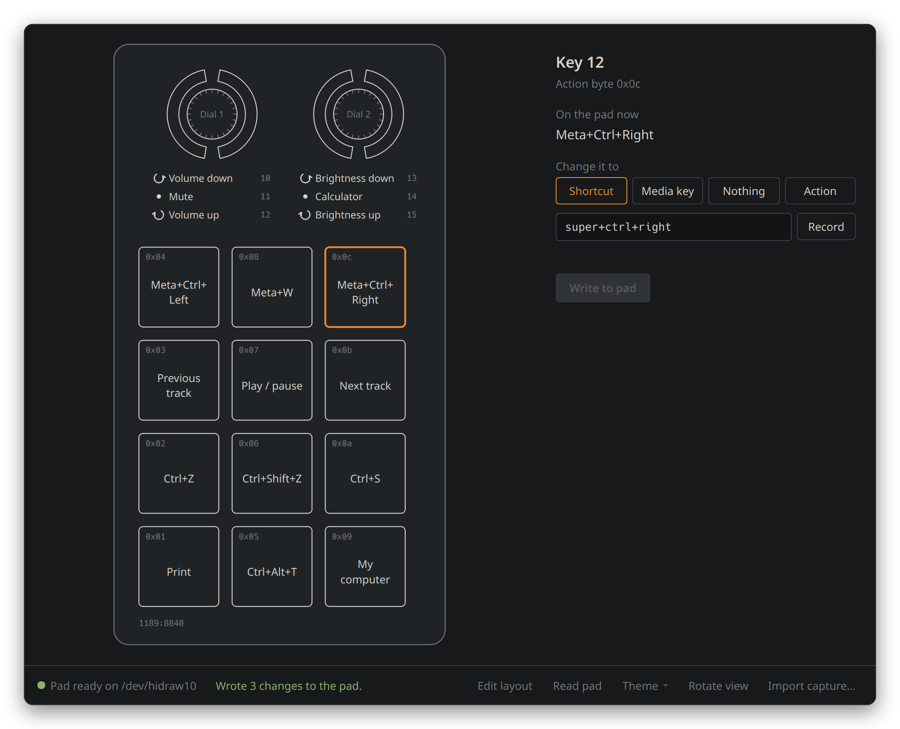
</p>

<p align="center">
  <a href="#-installing-and-first-use">Installing</a> &nbsp;|&nbsp;
  <a href="#-your-first-bindings">Quick Start</a> &nbsp;|&nbsp;
  <a href="#-troubleshooting">Help/Troubleshooting</a> &nbsp;|&nbsp;
  <a href="#-other-pads-in-this-family">Other Pads</a> &nbsp;|&nbsp; <!-- Supported Pads -->
  <a href="#-for-the-nerds">For the Nerds</a>
</p>

---

> [!NOTE]
> **Just want to install MacroPad?** Paste the following into your terminal to get started.
> ```
> curl -fsSL https://raw.githubusercontent.com/Probler-Yt/MacroPad/main/install.sh | bash
> ```

---


## 🔍 Is this my pad?

Probably, if yours looks like this:

- **12 keys** in a grid, plus **2 rotary knobs** (they turn and they click).
- Came from AliExpress, Amazon, Temu, eBay, or similar, often with no brand name.
- Came with software called **`MINI_KEYBOARD.exe`**, or a download link to it.
- Plugs in with USB and works as a keyboard straight away.

To be sure, open a terminal ([how?](#step-1-open-a-terminal)), type `lsusb` and press Enter. Look for this line:

```
Bus 001 Device 011: ID 1189:8840 Acer Communications & Multimedia USB Composite Device
```

The important bit is **`1189:8840`**. Don't worry about the "Acer" part: it isn't made by Acer, these pads just borrow that ID.

> [!NOTE]
> **Different number, like `1189:8890` or `1189:8842`?** That's a sibling of this pad with a different layout. MacroPad will spot it and tell you it isn't supported yet, rather than risk sending it the wrong thing. [ch57x-keyboard-tool](https://github.com/kriomant/ch57x-keyboard-tool) supports several of them today, and [you can help add yours here](#-other-pads-in-this-family).


## ✨ Overview

<!--| | |
|---|---|
| 🎹 **Click the drawing** | The window shows your pad as it really is. Click a key, or any part of a knob (turn left, press, turn right). |
| ⌨️ **Keyboard shortcuts** | Anything like `Ctrl+C`, `Ctrl+Shift+T`, `Meta+Ctrl+Right`, `F5`. Type it or press **Record** and just do the combo. |
| 🎵 **Media keys** | Play/pause, next, previous, stop, volume, mute, **screen brightness**, calculator, email, browser, my computer. |
| 🚫 **Nothing** | Switch a key off completely, so a stray press does nothing. |
| 🔄 **Rotate view** | Stand your pad up or lay it flat. The drawing turns to match. |
| 🧠 **Remembers what it wrote** | The pad can't be read back, so the app keeps its own notes and marks anything it doesn't know. |
| 🩺 **Tells you what's wrong** | Unplugged? No permission? Wrong pad? You get a plain explanation and the exact fix, with a copy button. |
| 📥 **Imports from the vendor app** | Set your pad up on Windows before? Bring that setup across. |-->

### Reading the UI

<p align="center">
  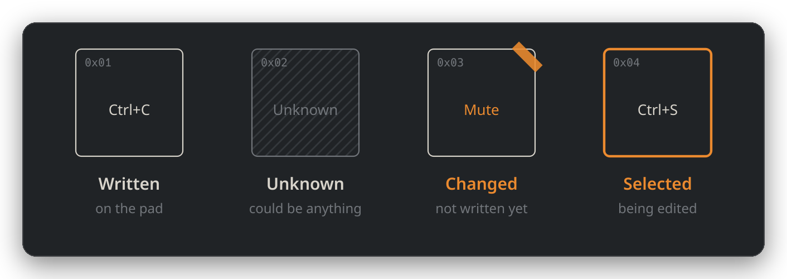
</p>

- **Written**: An action has been written to this key.
- **Unknown**: MacroPad does not know what this key does (this is most common on first usage).
- **Changed**: An action has been written to this key, but not yet sent to the pad.
- **Selected**: The currently selected key you are editing.

Each key's top-left corner shows that key's **action byte**, the number the pad uses for it internally. You can ignore it if you just want to use the app, otherwise it's there for anyone [adding support for another pad](#-other-pads-in-this-family).

### MacroPad or ch57x-keyboard-tool?

Both write straight to the pad's own memory, so you can even use both. Pick whichever suits you:

| | MacroPad | [ch57x-keyboard-tool](https://github.com/kriomant/ch57x-keyboard-tool) |
|---|---|---|
| How you use it | Click on the UI of your pad | Write a YAML file, run a command |
| Supported Pads | `1189:8840` (12 keys, 2 knobs) | `1189:8840`, `8842`, `8890`, several layouts |
| Operating Systems | Linux | Linux, macOS, Windows |
| Shortcuts | Yes | Yes |
| Media Keys | Yes | Yes |
| Key Sequences/Macros with Delays | Not Yet | Yes |
| Mouse actions, LED modes, Extra Layers | Not Yet | Yes |
| Record a shortcut by pressing it | Yes | No |
| Install and permissions | <a href="#-install-it-the-whole-world-is-counting-on-you">Via Terminal</a> &nbsp; | AUR, Installer, building with `cargo install`|

Other GUIs for these pads exist too (mostly for the smaller 3 and 6 key models) including one that runs in a web browser. You'll find them under the [ch57x topic on GitHub](https://github.com/topics/ch57x).


## 🚀 Installing and First Use

In a terminal, run the following:

```
curl -fsSL https://raw.githubusercontent.com/Probler-Yt/MacroPad/main/install.sh | bash
```

<details>
<summary>What does this command actually do?</summary>
<br>

>`curl` downloads `install.sh` from this GitHub repo, `bash` then runs the downloaded file. The installer is a normal text file, and you can [review it here](install.sh) or in your own text editor before running it if you like. Being suspicious of random commands from the internet is a good practice.
</details>
<br>

The install script downloads about 100 MB on some systems, so give it a minute. After installation, you may need to replug in your pad for Linux to notice the new permission.

From here, you can now open MacroPad; typically as you would any other app.

<p align="center">
  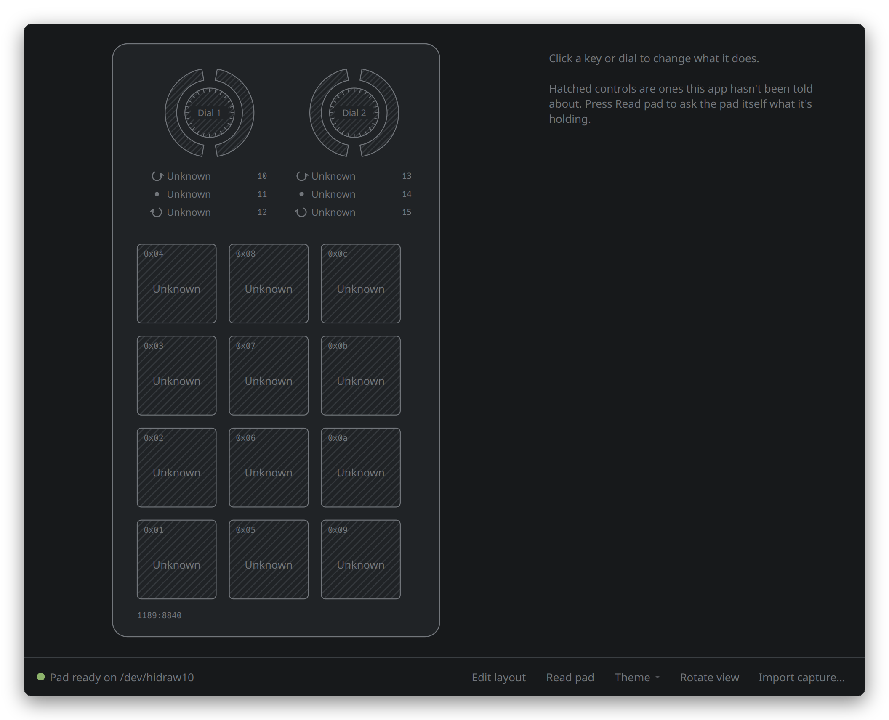
</p>

**Everything shows as unknown the first time you use MacroPad.** The app hasn't written anything to your pad yet, and most macro pads are write only.

If you see a **green dot** and "**Pad ready**" in the bottom left, then everything has installed correctly and works. If you see something else, the panel on the right will tell you exactly what to do, or find more specific help [here](#-when-something-goes-wrong).


## 🎯 Your First Bindings

First, pick any key on your pad. The panel to the right will provide writing options.

### Shortcuts

Click **Shortcut**, then type the combo into the box using `+` between keys: `ctrl+z`, `ctrl+shift+t`, `meta+e`, `f5`. Underneath, it confirms what the key will send. The key on the drawing gets a strip of orange tape to show it's changed but not sent yet.

The **Shortcut** option allows you to configure a key to send a specific keyboard key, or a combination of them. Type the key as you would expect to see it, such as `e`, `shift`, or `5`. `meta` maps to your Windows or CMD (MacOS) button

<details>
<summary>More specific keys</summary>
<br>

>- `lctrl` and `rctrl` will map to left and right control respectively
>- `capslock` will map to your Caps Lock
>- `scrolllock` will map to your Scroll Lock
>- Punction and symbols often need to be typed out
>   - \` for example maps from `grave`, [ from `leftbracket`
>- `ralt` will map to the "Alt Gr" key
>- `printscreen` will map to the Print Screen key (often labeled "PrtSc")
>- `super` and `win` work as fallbacks for `meta`
</details>
<br>

<p align="center">
  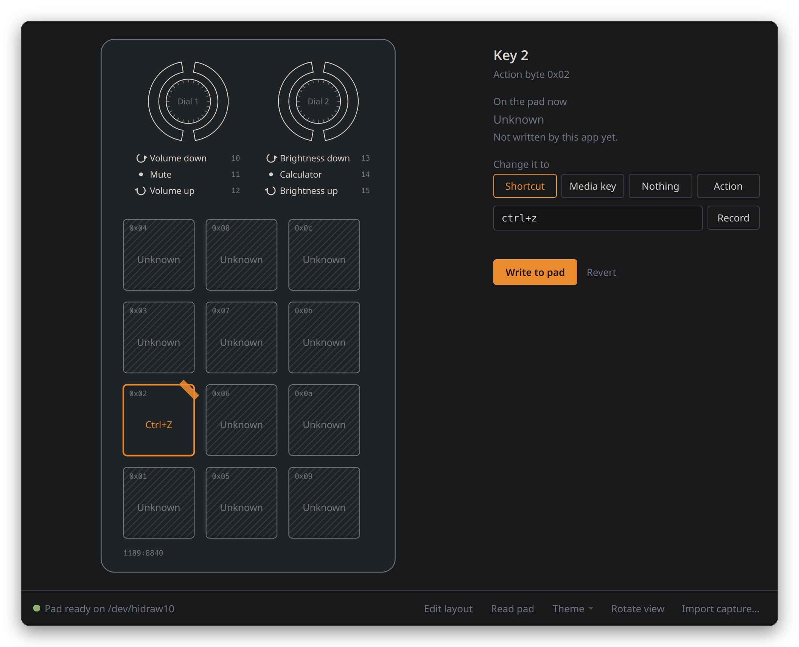
</p>

### Recording Combinations

When using the **Shortcut** option, the **Record** button will capture the combination of keys you press. It records the physical key you pressed, so the pad presses that same key whatever your keyboard layout (UK, German, American, etc.).

<p align="center">
  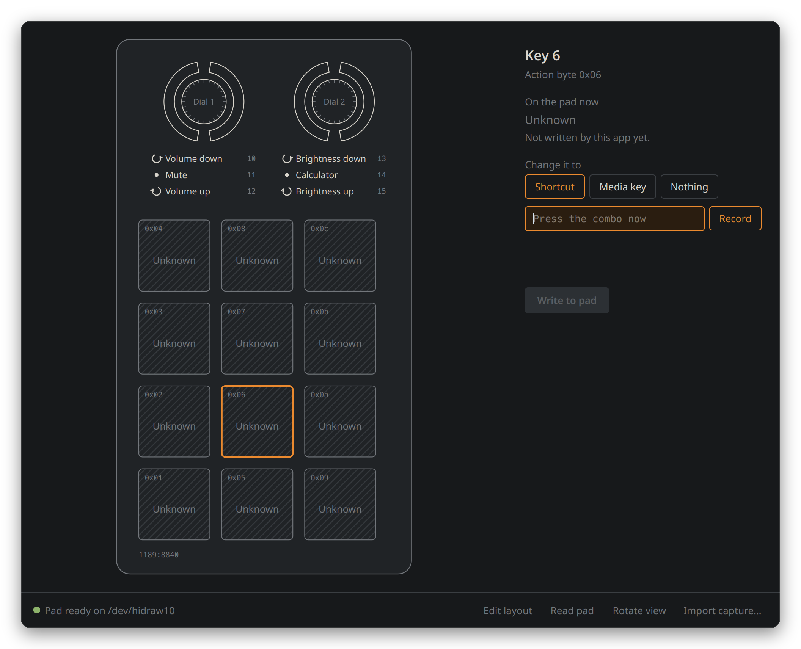
</p>

> [!NOTE]
> Your desktop grabs some combinations (such as those using the `Meta` key) before any app can see them. If Record doesn't catch one, just type it manually instead.

### Media Keys

Click **Media Key** and pick from the list.

<p align="center">
  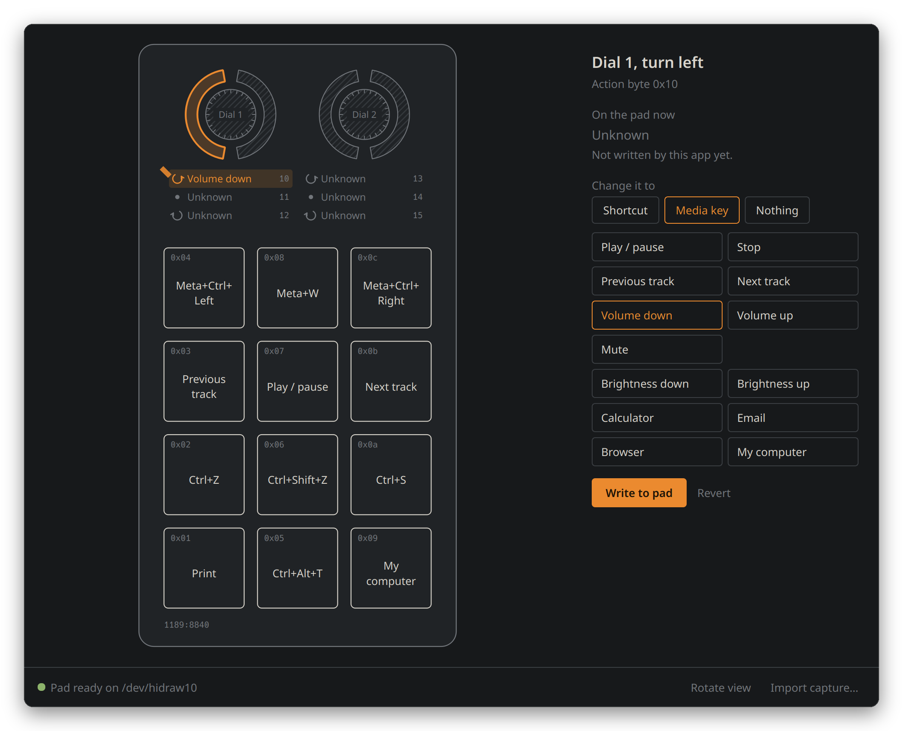
</p>

### Nothing

The **Nothing** option will blank out the bindings set to that key, making it so pressing it does nothing at all.

<p align="center">
  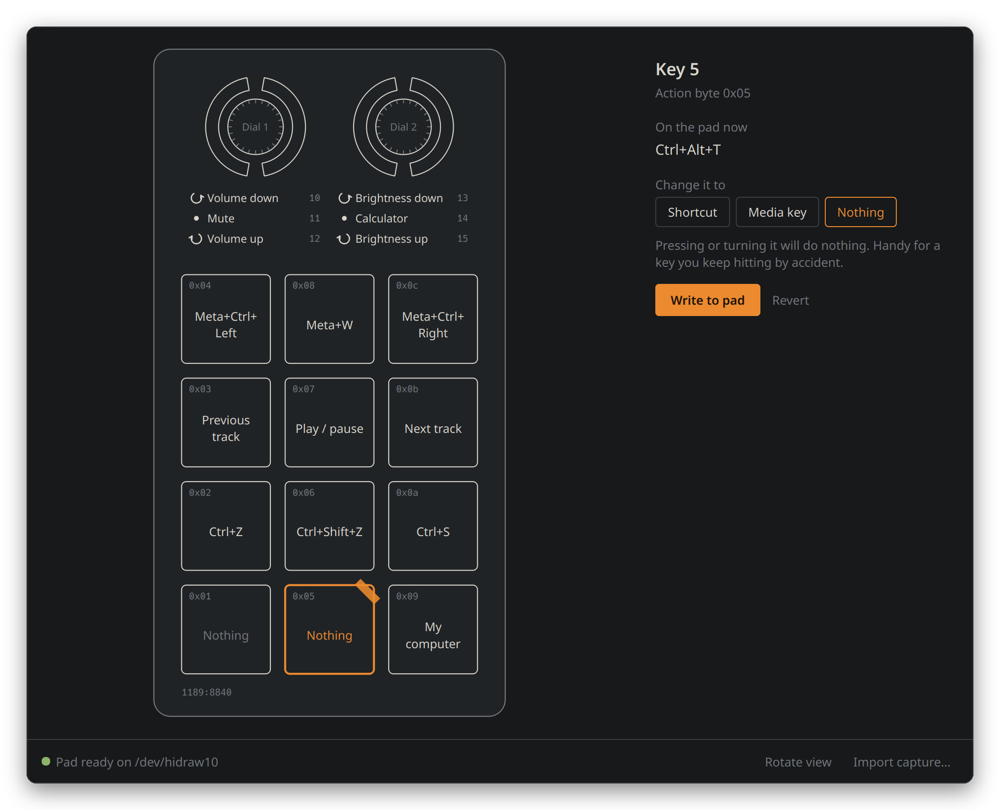
</p>

### Writing to the pad

Clicking **Write to Pad** will write only the selected key to your pad. The **Write x Changes** button at the bottom right will write all changes to the pad. After writing, you should see confirmation on the bottom.

<p align="center">
  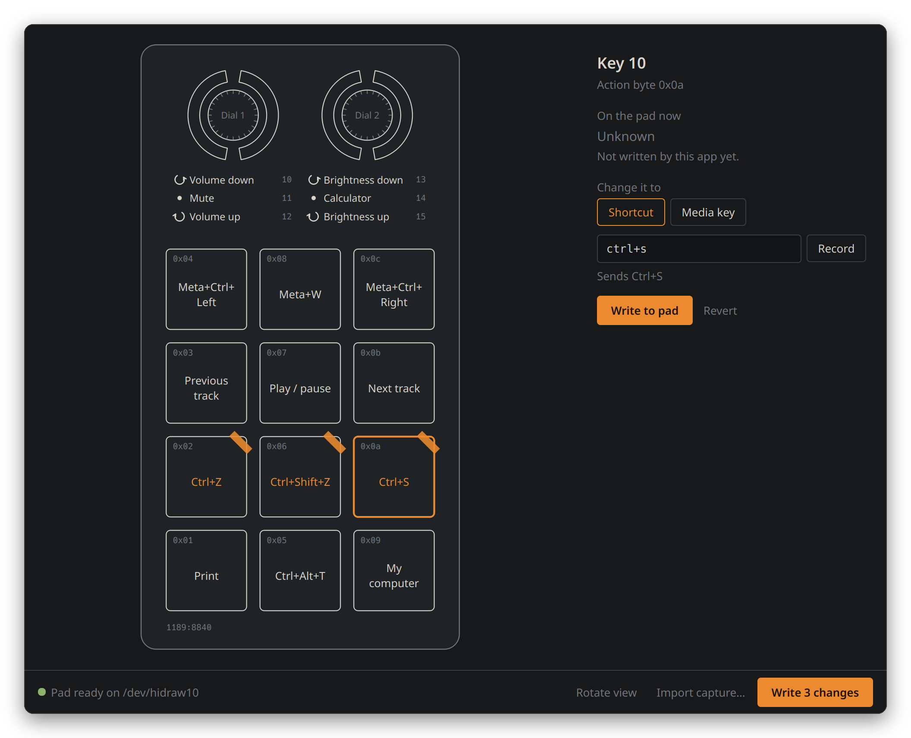
</p>


<p align="center">
  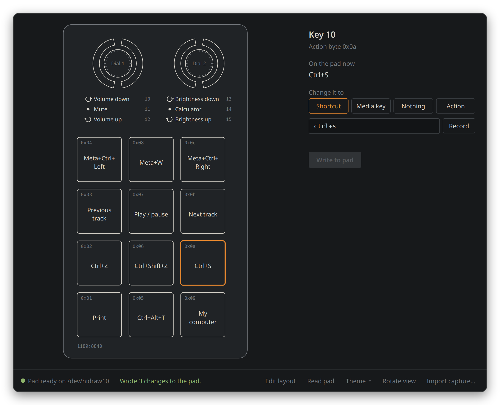
</p>

### Done!

Once changes have been written, you can close the app. **Your bindings live on the pad itself**, so they keep working after a reboot, or even on another computer or operating system. Nothing to run in the background.

## 🚀 Binding Actions

The pad itself can only ever send key presses. While it can't store a webpage for example, your computer can. Binding an action is split in two components:

- **On the pad**, the key is set to one of **F13 to F24**. Majority of keyboards do not have these keys and are unused.
- **On your computer**, a small listener watches for them and does what you asked.

<p align="center">
  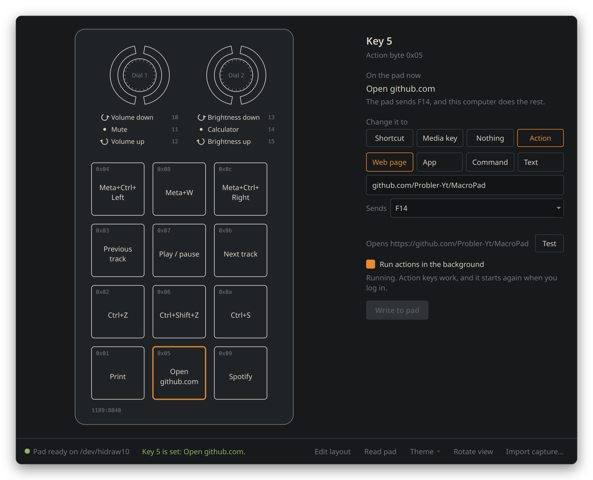
</p>

When you tick **Run actions in the background**, the listener starts now and every time you log in. It runs as your user, inside your desktop session, so web pages open in your own browser and apps start the way they would from your menu.


<details>
<summary>Useful information regarding Actions</summary>
<br>

>- **Actions are optional.** With it off, action keys send F13 to F24 and nothing happens. Every other key on the pad carries on working, because those live on the pad.
>- **Changing what an action does doesn't touch the pad.** The key keeps its F13 to F24 code; only the what the listener does changes.
>- **You can choose which spare function key.** Some keyboards do have some of if not all the F13 to F24 keys. You can manually select a funciton key in this range, and will be shown which function keys are already in use and also which ones your desktop is known to act on. "Automatic" will have it try quieter keys first.
>- **Limit of 12 Actions.** One per key in the range of F13 to F24.
>- **Text pastes a phrase wherever your cursor is.\*** The text action will paste what is stored where your cursor (or highlighted text prompt) is. This can include multiple lines, symbols, and emoji. This *will* replace whatever is currently on your clipboard. An option allows for pasting with `Ctrl+Shift+V` to allow pasting in a terminal window.
>- **Commands run as your user, in a shell.** Anything you could type in a terminal works, including scripts. Actions are kept in `~/.config/macropad/actions.json`; treat this file like any other script and don't paste in scripts from untrusted sources.
>- **No extra permissions.** The listener reads the pad through the same access the rest of the app already has.

*Text needs two things the other actions don't: **wl-clipboard** (or xclip on X11) to set the clipboard, and permission to press the paste shortcut for you (similar to the same rule Steam installs for its controllers). If either is missing, the app will tell you and also show you the commands to fix it.
</details>
<br>

The idea of pairing F13 to F24 with a listener comes from [armas01's macropad-controller](https://github.com/armas01/macropad/tree/main/macropad-controller), which does this for the 3 and 6 key pads.


## 🎛️ The knobs

Each knob does three separate things, and each gets its own binding:

| UI | Pad Action |
|---|---|
| Left half of the ring | **Turn left** (anticlockwise) |
| Middle circle | **Pressing** the knob down |
| Right half of the ring | **Turn right** (clockwise) |

You can also click the three lines of text under each knob. Every click of a turn sends the key once.

> [!IMPORTANT]
> **Screen brightness on a desktop monitor** works too, *if* your desktop supports it. For example, KDE Plasma 6 does it out of the box for monitors with DDC/CI (sometimes can be found as a setting in the monitor's own OEM settings menu).


## 🎨 Visuals

### Layout Editing

**Edit layout** at the bottom allows you to change how the UI looks to better match a compatible pad with a different layout. This maybe useful as pads only report the number of keys they have, not their layout.

Editing the layout allows you to drag keys around to match your layout. Two keys swap when you drop one onto the other. The boxes along the bottom set the grid size and how many keys and knobs there are. **Rotate view** allows you to view your pad laid horizontally, with the knobs to the right.

This only changes the UI, and writes nothing to the pad.

<p align="center">
  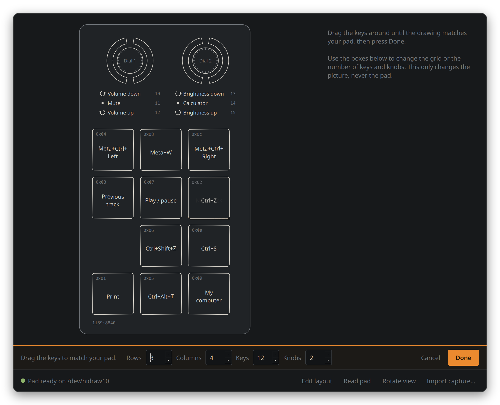
</p>


### Themes

Seven of them, under **Theme** at the bottom of the window. The choice sticks.

<p align="center">
  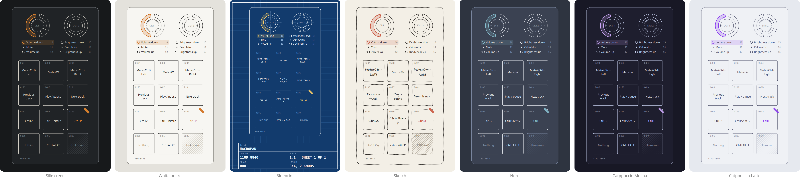
</p>

- **Silkscreen**, the default: a dark circuit board with white printed legends and Kapton tape for unwritten changes.
- **White board**: the same, on a white board, for anyone who wants a light theme.
- **Nord**, **Catppuccin Mocha** and **Catppuccin Latte**: the popular palettes, as their authors published them.

**Blueprint** and **Sketch** are more "fun" themes compared to the others, and overhaul the entire UI.


## 📥 Already set it up with the vendor app?

If you configured your pad with `MINI_KEYBOARD.exe` and recorded it with the included capture tool ([how](#capture-what-the-vendor-software-sends)), click **Import capture...** and choose the file. The app reads what was saved and fills in the drawing, so those keys stop showing as unknown.

Only do this if nothing has changed on the pad since that capture, as this will not write these changes. It only fills in the UI.


## 🩹 Troubleshooting

The app checks your pad every couple of seconds and explains any problem in the panel on the right, with the exact fix and a **Copy commands** button. Here's everything it might say.

If your problem isn't listed here, [open an issue](https://github.com/Probler-Yt/MacroPad/issues).

### Why does it say "Unknown"?

Striped or Unknown keys aren't necessarily broken, usually they're just keys this app hasn't touched yet. Because **these pads are write only**, this is typically seen when using this for the first time. Even the official Windows app opens with every key blank. The app keeps its own record of successfully written keys.

If a write fails before anything reaches the pad, nothing changes. <br>
If a write fails **halfway**, that key goes back to **Unknown**, because the honest answer is "no idea". Just write it again.


### "No pad connected"

The app can't see your pad. Unplug it and plug it back in, or try another USB port. If it's a USB hub, try plugging straight into the computer.


### "No permission to write to the pad"

<p align="center">
  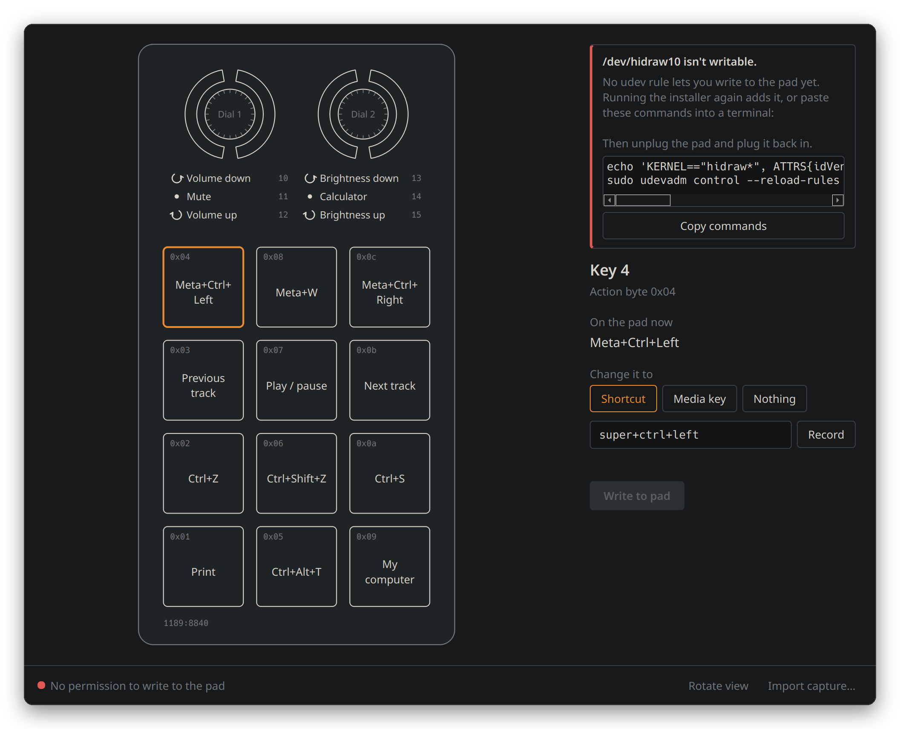
</p>

This is due to Linux protects USB devices from apps by default. You can **run the installer again** and say yes when it asks to change permissions, or click **Copy commands** and paste them into a terminal to manually change the permissions. Make sure to unplug and plug your pad back in.

Usually this happens for three reasons:

- **No rule yet.** The permission file doesn't exist.
- **Rule not loaded.** It exists, but Linux hasn't noticed. Unplug and plug your pad back in.
- **Rule named wrong.** If you made one yourself called something like `99-macropad.rules`, it's read *too late* to work. It needs a number below 73 ([Why?](#the-udev-rule-that-cost-me-an-hour)).


### "Heads up: keyd is remapping this pad"

<p align="center">
  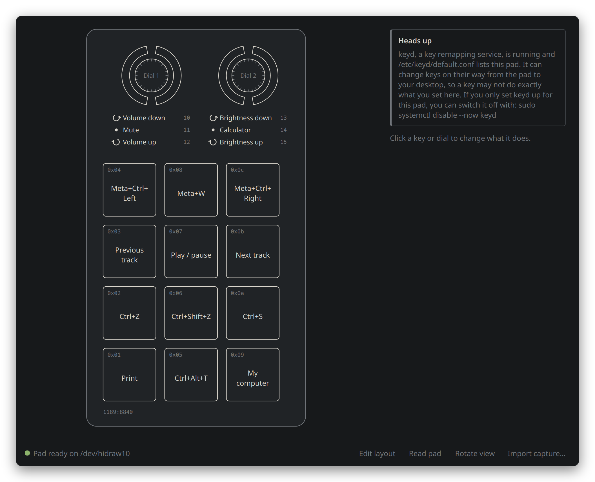
</p>

**keyd** is a program that changes keys as they travel from a keyboard to your desktop. If you set it up for this pad in the past, it may change what your pad sends. This app makes it so this is no longer required. If you only used it for the pad, switch it off:

```
sudo systemctl disable --now keyd
```

Saving bindings works fine either way. keyd only affects keys *coming out* of the pad.


### "Found a 1189:xxxx pad, which this app doesn't know yet"

You have a sibling pad with a different layout. The app refuses to write to it on purpose, because the wrong layout could scramble it. [You can help add it.](#-other-pads-in-this-family)


### "Couldn't write Key 4: the pad stopped responding"

The pad disconnected from USB partway through a write, often due to a loose cable or a busy hub. Unplug it, plug it back in, and click **Write to pad** again.


### Record doesn't catch my shortcut

Your desktop keeps some combos for itself (on Plasma, most `meta` shortcuts), so no app ever sees them. Type it into the box instead, for example `meta+ctrl+right`.


### A media key does nothing

Play, volume, mute and brightness work everywhere. **Calculator**, **Email**, **Browser** and **My Computer** depend on your desktop having an app assigned to them. If one does nothing, set it up in your desktop's shortcut settings.


### "qt.qpa.services: Failed to register with host portal" in the terminal

This appears if you run the app before its launcher is installed. The installer adds the launcher, and the message goes away.


### The window looks wrong or won't open

Run `macropad` in a terminal and read the last few lines it prints. If it mentions `xcb` or a "platform plugin", run the installer again, which adds the missing library. If you're still stuck, [open an issue](https://github.com/Probler-Yt/MacroPad/issues) and paste what it printed.


## ♻️ Updating and Removing

**To update:** Reinstall the app. Your bindings and settings stay put.

**To remove:**

```
~/.local/share/macropad/app/uninstall.sh
```

It asks before removing the permission rule or the app's notes. Your pad will still using the last bindings written to it until changed again.


## 🧬 Other pads in this family

This app is **confirmed to work on `1189:8840`**, the 12 key, 2 knob pad. For now, it's the only pad it knows.

> [!TIP]
> **Want to change a different pad right now?** [ch57x-keyboard-tool](https://github.com/kriomant/ch57x-keyboard-tool) supports `1189:8840`, `1189:8842` and `1189:8890` in several layouts (3, 6, 9, 12 and 15 keys) from the command line.

Siblings come in other sizes, and several share vendor ID `1189`. **They don't all speak the same language:** ch57x-keyboard-tool has separate code for different families, and rOzzy1987's Windows project lists yet more IDs (`8830`, `8831`, `8832`, `8897`, `8874`) with their own formats. This is why MacroPad won't write to a pad it doesn't know.

<p align="center">
  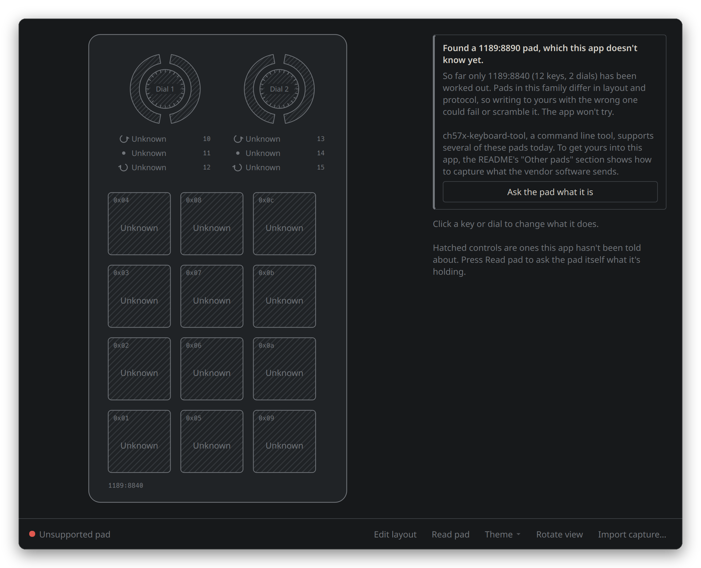
</p>

### Adding your own Pad

If you'd like your pad in MacroPad too, you'll need the vendor software (`MINI_KEYBOARD.exe`) and Wine.

#### Capture what the vendor software sends

1. **See what your pad is:**
   ```
   python3 ~/.local/share/macropad/app/macropad-probe.py
   ```
   This lists your pad's ID and its USB interfaces.

2. **Start the capture:**
   ```
   cd ~/.local/share/macropad/app
   sudo python3 macropad-capture.py
   ```

3. **In a second terminal**, open the vendor app with Wine:
   ```
   wine MINI_KEYBOARD.exe
   ```

4. In the vendor app, set **key 1 to the letter `a`** and click its save/apply button. Then set **each knob's turn left, press and turn right** to different letters, and save again.

5. Go back to the first terminal and press **`Ctrl+C`**. You now have a file called `macropad-capture.txt`.

6. **[Open an issue](https://github.com/Probler-Yt/MacroPad/issues)** with that file, your `macropad-probe.py` output, and a photo of your pad. That's genuinely all it takes to get your pad supported.


## 🪟 Windows Support?

Windows already works with apps from vendors shipped as `.exe` files, and [ch57x-keyboard-tool](https://github.com/kriomant/ch57x-keyboard-tool).

That said, the app is built on Qt, which runs on Windows and macOS too. The only Linux specific parts are the small pieces that talk to USB and check permissions. Swapping it for a cross platform one is on the [roadmap](#-roadmap), and once that's tested on real hardware, one app will work everywhere. Windows testing is welcome once support begins development.

---

## 🤓 For the Nerds

<details>
<summary><b>How this pad was reverse engineered</b></summary>

1. **Probe.** `macropad-probe.py` walks `/sys/class/hidraw` and decodes each HID report descriptor. The pad shows up as two interfaces: a normal keyboard (`Generic Desktop`) and a vendor defined one (usage page `0xff00`) with a 64 byte input and output report, ID 3. That's the config channel.
2. **Guess.** The upstream project documents two protocols, "Legacy" and "Extended". Both were tried. The pad accepted the reports and then quietly ignored them. Educated guessing had run out.
3. **Watch.** The breakthrough was noticing `MINI_KEYBOARD.exe` runs under Wine. Linux's `usbmon` can record every USB transfer, so `macropad-capture.py` watched the real software write a single key. Twenty minutes of watching beat hours of guessing.
4. **Repeat.** Separate captures of the knobs and of media keys filled in the rest. Every packet from every capture is now replayed by the test suite.

Lesson learned the hard way: [ch57x-keyboard-tool](https://github.com/kriomant/ch57x-keyboard-tool) had already worked out most of this, and its source is the best reference for these pads. Search before you sniff.

</details>

<details>
<summary><b>The wire format</b></summary>

Every binding is two 65 byte writes to `/dev/hidrawN`: a config report, then a commit.

```
03 fd 01 01 01 00 00 00 00 00 01 00 05 00 ...    key 1 -> 'b'
│  │  │  │  │  └──┬┘ └───┬──┘ │  │  └── keycode (HID usage 0x05 = b)
│  │  │  │  │     │      │    │  └───── modifier bitmask
│  │  │  │  │     │      │    └──────── count
│  │  │  │  │     │      └───────────── unused
│  │  │  │  │     └──────────────────── delay? (unverified, see below)
│  │  │  │  └────────────────────────── type: 1 keys, 2 media, 3 mouse, 8 LED
│  │  │  └───────────────────────────── layer, counted from 1
│  │  └──────────────────────────────── action: which control
│  └─────────────────────────────────── magic
└────────────────────────────────────── report ID

03 fd fe ff 00 00 ...                            commit
```

**Action bytes on 1189:8840**

| Control | Bytes |
|---|---|
| Keys 1 to 12 | `0x01` to `0x0c` (the firmware reserves up to `0x0f`) |
| Knob 1: turn left, press, turn right | `0x10`, `0x11`, `0x12` |
| Knob 2: turn left, press, turn right | `0x13`, `0x14`, `0x15` |

**Media keys** pack differently: count is always `2`, and the 16 bit consumer usage follows it directly, little endian.

```
03 fd 08 01 02 00 00 00 00 00 02 92 01 00 ...    key 8 -> Calculator (usage 0x0192)
```

**Modifier bitmask** (standard HID): `0x01` Ctrl, `0x02` Shift, `0x04` Alt, `0x08` Meta, and `0x10` to `0x80` for the right hand versions.

The vendor app sometimes sends several configs and one commit at the end. Both styles work. This app commits after every binding, so it always knows exactly which ones landed.

**Delays** are the open question. The byte field above comes from rOzzy1987's format and hasn't been seen on this pad. ch57x-keyboard-tool sends a delay as a separate report of type `5` instead, which is probably right. That's why sequences are switched off in the app until a capture settles it.

</details>

<a name="what-we-found"></a>
<details>
<summary><b>Three sources, compared</b></summary>

What each source sends to a `1189:8840`. The pad accepts the ch57x-keyboard-tool style and the vendor style, so it's evidently tolerant. Nothing here is a new discovery about the hardware; the last column is simply what the vendor's own software does, captured independently.

| | rOzzy1987 "Extended" | [ch57x-keyboard-tool](https://github.com/kriomant/ch57x-keyboard-tool) | Vendor app (captured) |
|---|---|---|---|
| Byte 1 of a config report | `0xFE` | `0xFE` | **`0xFD`** |
| Layers counted from | `0` | `1` | `1` |
| First knob action | `13` | `0x10` | `0x10` |
| Media: count, usage offset | from payload, 12 | `0`, 11 | **`2`**, 11 |
| Delay | bytes 5 and 6 | separate report, type `5` | not captured yet |
| Finishing a write | flash command | `aa aa`, `fd fe ff`, `aa aa` | `fd fe ff` |

rOzzy1987's format is for different product IDs, which is why porting it to this pad failed until the capture.

</details>

<details>
<summary><b>usbmon only shows you 32 bytes</b></summary>

The kernel's `usbmon` text interface caps captured data at 32 bytes per transfer. Every line in a capture is exactly 32 bytes, even though the reports are 65. For single keys and media that's plenty. For long key sequences, anything past the 10th key lands in bytes nobody has seen yet. If you're capturing long macros, use Wireshark or the binary `/dev/usbmonN` interface instead.

</details>

<a name="the-udev-rule-that-cost-me-an-hour"></a>
<details>
<summary><b>The udev rule that cost me an hour</b></summary>

The standard way to give desktop users access to a device is `TAG+="uaccess"` in a udev rule. Everyone names these `99-something.rules`. **That doesn't work.**

udev reads every rules file in one lexical order by filename. The tag is only turned into an actual permission by systemd's `73-seat-late.rules`, which contains:

```
TAG=="uaccess", ENV{MAJOR}!="", RUN{builtin}+="uaccess"
```

A rule in `99-macropad.rules` adds the tag *after* that line has already run. The device is tagged, and nothing ever acts on it. Same for a file with no number at all, since letters sort after digits. The rule has to sort before `73-`, so MacroPad uses `60-macropad.rules`.

The app's permission check reads `udevadm info` to see whether the device got the tag, finds any rule file mentioning the pad, and compares its name against whichever file on *your* system applies the permission.

</details>

<details>
<summary><b>Where the app keeps its notes</b></summary>

`~/.config/macropad/state-1189-8840.json` holds everything the app has successfully written. Every entry is exactly a command the CLI understands:

```json
{
  "device": "1189:8840",
  "format": 1,
  "layers": {
    "1": {
      "dial1-left": { "binding": { "media": "volumedown" }, "written": "2026-09-11T18:02:11" },
      "key4":       { "binding": { "keys": "super+ctrl+left" }, "written": "2026-09-11T18:02:11" },
      "key7":       { "reason": "write interrupted after 1 of 2 reports", "unknown": true }
    }
  }
}
```

It's written atomically (write, then rename), so a crash can never leave half a file.

</details>

<details>
<summary><b>Command line</b></summary>

No window needed. `macropad.py` is plain Python with nothing to install:

```
cd ~/.local/share/macropad/app
python3 macropad.py controls                      # every name you can use
python3 macropad.py set key1 ctrl+c
python3 macropad.py set dial1-right volumeup
python3 macropad.py set key3 "ctrl+shift+n" --dry-run   # show the bytes, send nothing
python3 macropad.py set action:0x10 f5            # raw action byte, for other pads
macropad doctor                                   # the app's permission check, in text
```

The CLI doesn't update the app's notes. Things set this way show as whatever the app last knew.

</details>

<details>
<summary><b>Tests</b></summary>

```
python3 -m unittest -v
```

The suite replays every packet from every real capture in `tests/captures/`, decodes it, re-encodes it, and checks the bytes match exactly. It also covers the permission diagnosis, half-finished writes, and builds the whole window offscreen. Screenshots in this README are generated by `docs/make_screenshots.py` from the real app.

</details>

### Project layout

```
macropad.py              the protocol and the command line tool (no dependencies)
macropad_gui/
  core.py                bindings, the app's notes, the permission check, writing
  padview.py             the drawing of the pad
  app.py                 the window
  keymap.py              physical key to HID name, for Record
macropad-probe.py        read only: what is this device?
macropad-capture.py      watch what the vendor software sends (usbmon)
macropad-handshake.py    which report IDs does a pad accept?
install.sh, uninstall.sh
packaging/               launcher icon and the udev rule
tests/                   real captures and the tests that replay them
```

---

## 🧭 Roadmap

- [x] Keys, shortcuts and media keys on `1189:8840`
- [x] Both knobs, all three actions each
- [x] Upright and flat views
- [x] One line installer for any distro
- [ ] **Key sequences with delays** (ch57x-keyboard-tool shows the likely format; one capture to confirm)
- [ ] Layers 2 and 3, and LED modes
- [ ] AUR package, so Arch users can install it like anything else
- [ ] Knob press to toggle brightness between 0% and 100%
- [ ] Save and switch between named profiles (gaming, editing, streaming)
- [ ] **Windows and macOS** via a cross platform USB layer
- [ ] **More pads**: every capture sent in gets us closer

---

## 🙏 Credits

- **[kriomant/ch57x-keyboard-tool](https://github.com/kriomant/ch57x-keyboard-tool)**, the MIT licensed command line tool that has supported these pads since 2023. It does more than MacroPad does today (layers, sequences, mouse, LEDs, more pads, every OS), and its source is the best reference there is. Go give it a star.
- **[rOzzy1987/MacroPad](https://github.com/rOzzy1987/MacroPad)**, whose Windows project this app's protocol code started from.
- Everyone on forums who documented running a whole VM to change a key. Your suffering was noted.

## ⚖️ Licence

GPL-3.0, the same as the project it builds on. Use it, change it, share it. If you share a changed version, share the source too.

<!--

<sub>
<b>Also known as:</b> macro pad software for Linux, MINI_KEYBOARD.exe alternative, mini keyboard configurator, 12 key macro keyboard with 2 knobs, USB macro keypad with rotary encoders, AliExpress macro pad driver for Linux, custom shortcut keypad for Linux, Acer Communications &amp; Multimedia USB Composite Device (1189:8840), macropad on Arch, CachyOS, Fedora, Ubuntu, Linux Mint, Pop!_OS, Bazzite, KDE Plasma and GNOME, on Wayland and X11.
</sub>
-->
